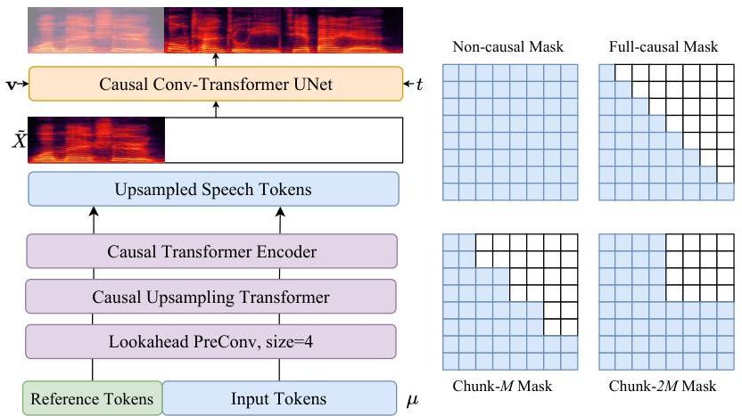
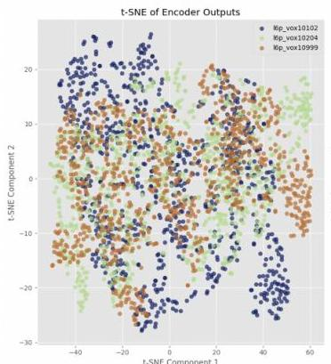
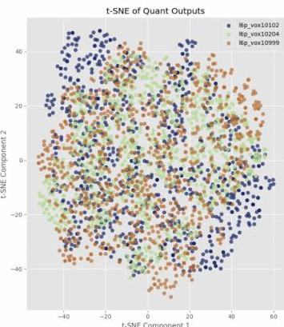
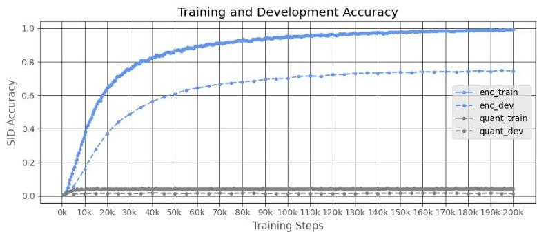

# 1. 论文基本信息

## 1.1. 标题
CosyVoice 2: Scalable Streaming Speech Synthesis with Large Language Models

## 1.2. 作者
Zhihao Du, Yuxuan Wang, Qian Chen, Xian Shi, Xiang Lv, Tianyu Zhao, Zhifu Gao, Yexin Yang, Changfeng Gao, Hui Wang, Fan Yu, Huadai Liu, Zhengyan Sheng, Yue Gu, Chong Deng, Wen Wang, Shiliang Zhang, Zhijie Yan, Jingren Zhou
所属机构：Alibaba Group, China
主要联系邮箱：{neo.dzh, sly.zsl}@alibaba-inc.com

## 1.3. 发表期刊/会议
论文作为预印本发表于 arXiv。arXiv 是一个知名的预印本（preprint）服务平台，在人工智能、计算机科学等领域具有广泛的影响力。论文在此平台发布意味着其研究成果已公开，但尚未经过正式的同行评审或会议/期刊出版流程。

## 1.4. 发表年份
2024年

## 1.5. 摘要
在先前的研究中，作者提出了 CosyVoice，这是一个基于监督离散语音词元（supervised discrete speech tokens）的多语言语音合成模型。CosyVoice 利用语言模型（LMs）和流匹配（Flow Matching）两种流行的生成模型进行渐进式语义解码（progressive semantic decoding），在上下文学习（in-context learning）中展现了高韵律自然度（prosody naturalness）、内容一致性（content consistency）和说话人相似性（speaker similarity）。

鉴于多模态大语言模型（LLMs）的最新进展，语音合成的响应延迟（response latency）和实时性（real-time factor）对于交互体验至关重要。因此，本文报告了改进后的流式语音合成模型 CosyVoice 2，该模型包含了全面系统的优化。具体来说，CosyVoice 2 引入了有限标量量化（finite-scalar quantization）来提高语音词元（speech tokens）的码本利用率（codebook utilization）。对于文本-语音语言模型（text-speech LM），模型架构被精简化，允许直接使用预训练的 LLM 作为主干网络（backbone）。此外，本文还开发了一个块感知因果流匹配（chunk-aware causal flow matching）模型，以支持各种合成场景，在单个模型内实现了流式和非流式合成。

通过在大规模多语言数据集上进行训练，CosyVoice 2 在流式模式下实现了与人类相当的自然度（human-parity naturalness）、最小的响应延迟和几乎无损的合成质量。

## 1.6. 原文链接
原文链接: https://arxiv.org/abs/2412.10117v3
PDF 链接: https://arxiv.org/pdf/2412.10117v3.pdf
发布状态: 预印本（Preprint），当前版本为v3。

# 2. 整体概括

## 2.1. 研究背景与动机
**论文试图解决的核心问题：**
现有的零样本文本到语音（zero-shot TTS）模型通常工作在非流式（offline）模式下，这意味着它们需要完整的输入文本，并且必须在返回波形之前合成整个语句。这种模式导致了高延迟，严重影响了诸如语音聊天（voice chat）等多模态大语言模型（multi-modal large language models, LLMs）交互应用的用户体验。流式合成（streaming synthesis）解决方案在基于语言模型的零样本 TTS 中已有探索，但在基于扩散（diffusion-based）的 TTS 模型和混合（hybrid）系统中缺乏完善的流式解决方案。

**为什么这个问题在当前领域是重要的？**
随着 LLM 的兴起，尤其是多模态 LLM 的发展，人机交互对实时性提出了更高要求。例如，在 GPT-4o 这样的语音聊天应用中，用户期望能够几乎同步地听到 LLM 的语音响应，而不是等待整个句子合成完毕。高延迟会打断对话的流畅性，降低用户体验。因此，开发低延迟、高质量的流式语音合成技术是当前 LLM 交互领域的一个重要挑战。

<strong>现有研究存在的具体的挑战或空白（Gap）：</strong>
*   **非流式模式为主：** 大多数先进的零样本 TTS 模型（包括基于扩散和混合系统）都是非流式操作，导致高延迟。
*   **缺乏统一的流式解决方案：** 尽管语言模型（LM）基的 TTS 模型已探索流式合成，但对于更复杂的基于扩散或混合 TTS 系统，尚未有成熟且统一的流式解决方案。
*   **性能下降：** 实现流式合成往往需要牺牲合成质量或自然度。

**这篇论文的切入点或创新思路：**
CosyVoice 2 的切入点是在其前身 CosyVoice （一种混合系统）的基础上，进行全面的系统优化，以实现高质量、低延迟的流式语音合成，并统一流式和非流式合成在一个模型框架内。其创新思路体现在以下几个方面：
1.  **统一流式与非流式合成：** 提出了一种统一的文本-语音语言模型和块感知因果流匹配模型，使得单个模型能支持两种模式，并实现流式合成接近无损的质量。
2.  **简化语言模型架构：** 通过移除文本编码器和说话人嵌入，并直接利用预训练的大语言模型（LLM）作为主干网络，增强了上下文理解能力并简化了模型。
3.  **改进语音词元量化：** 引入有限标量量化（Finite Scalar Quantization, FSQ）替代向量量化（Vector Quantization, VQ），提高码本利用率和信息捕获能力。
4.  **块感知因果流匹配：** 针对流匹配模型引入块感知因果机制，使其能够支持流式处理。
5.  **增强指令式合成能力：** 整合了更多的自然语言和细粒度指令，提升了模型的控制力和表现力。

## 2.2. 核心贡献/主要发现
**论文最主要的贡献：**
*   **统一流式与非流式合成框架：** 首次在单个模型框架内实现了流式和非流式 TTS 的统一，特别是在流式模式下实现了与离线模式几乎无损的合成质量。
*   **LLM 驱动的文本-语音 LM：** 通过直接利用预训练的大语言模型作为文本-语音语言模型的主干网络，简化了架构并提升了文本理解和韵律建模能力。
*   **创新的语音词元化：** 引入有限标量量化（FSQ）改进语音词元（speech tokens）的码本利用率和信息保持能力，增强了语义表示。
*   **块感知因果流匹配模型：** 提出了适用于流式合成的因果流匹配模型，有效解决了流匹配模型在流式场景下的应用空白。
*   **强大的指令式 TTS 能力：** 大幅升级了指令式 TTS 的能力，支持更多样化的情绪、口音、角色风格和细粒度控制。

**论文得出了哪些关键的结论或发现？**
*   CosyVoice 2 在大规模多语言数据集上训练后，在流式模式下实现了与人类相当的自然度、极低的响应延迟和几乎无损的合成质量。
*   有限标量量化（FSQ）显著提高了码本利用率和信息保持，并且在解耦说话人身份信息方面表现出色。
*   LLM 初始化、移除说话人嵌入和 FSQ 的引入对模型性能有显著提升，特别是在内容一致性方面。
*   流式语言模型和流式流匹配模型在典型测试案例中对性能影响极小，表明统一训练框架的有效性。
*   CosyVoice 2 在中文和英文数据集上表现出最先进的性能，在处理复杂文本（test-hard）方面展示了强大的鲁棒性。
*   模型在日语和韩语合成方面也表现出潜力，但语言间的字符重叠和数据不平衡可能影响性能。
*   指令式生成能力显著增强，在准确性和自然度方面优于前代模型。
*   通过多说话人微调（mSFT）和强化学习（RL）可以进一步提升特定说话人的合成质量和鲁棒性。

# 3. 预备知识与相关工作

## 3.1. 基础概念
为了理解 CosyVoice 2 的工作原理，需要了解以下基础概念：

*   <strong>文本到语音（Text-to-Speech, TTS）合成：</strong> 将文本输入转换为自然听起来的语音输出的技术。
*   <strong>零样本 TTS（Zero-shot TTS）：</strong> 能够在没有特定说话人训练数据的情况下，合成具有任意说话人声音特征（如音色、韵律、风格）的语音，通常通过模仿一段参考语音来实现。
*   <strong>语音编码器（Speech Codec）：</strong> 将连续的语音波形压缩成离散的数字表示（通常是码本中的词元，即 `tokens`），并在需要时将其解码回语音波形。其目的是在保持语音质量的同时大幅减少数据量。
*   <strong>语音词元（Speech Tokens）：</strong> 语音编码器生成的离散表示，类似于文本中的单词或音素。
*   <strong>语言模型（Language Model, LM）：</strong> 一种能够预测序列中下一个词元（`token`）的概率分布的模型。在 TTS 中，它被用于将文本词元转换为语音词元。
*   <strong>流匹配（Flow Matching）：</strong> 一种新型的生成模型，通过学习将简单的噪声分布连续变换为复杂数据分布的向量场（`vector field`）来生成数据。它与扩散模型（`Diffusion Models`）类似，但通常在采样效率上有所提高，因为它直接学习确定性的传输流。
*   <strong>流式合成（Streaming Synthesis）：</strong> 实时或近实时地生成语音，即边接收输入文本边合成语音，而不是等待所有输入文本到达后再开始合成，以降低响应延迟。
*   <strong>非流式合成（Non-streaming/Offline Synthesis）：</strong> 接收完整的输入文本，然后一次性合成整个语音波形。
*   <strong>码本利用率（Codebook Utilization）：</strong> 在离散化（如量化）过程中，码本中所有可用码字（`codewords`）被实际使用的程度。高利用率意味着码本能更有效地代表输入数据的多样性。
*   <strong>有限标量量化（Finite Scalar Quantization, FSQ）：</strong> 一种量化方法，将连续值映射到有限个离散的标量值。与向量量化（VQ）相比，它简化了码本结构，可能提高利用率。
*   <strong>大语言模型（Large Language Models, LLMs）：</strong> 具有数亿到数万亿参数的深度学习模型，经过海量文本数据训练，擅长理解和生成人类语言。
*   <strong>主干网络（Backbone）：</strong> 深度学习模型中的核心特征提取器部分，通常是预训练模型，负责从输入数据中提取高级特征。
*   <strong>梅尔频谱（Mel Spectrogram）：</strong> 语音信号的一种时频表示，模拟人类听觉系统对不同频率的感知。在 TTS 中常用作中间声学特征。
*   <strong>声码器（Vocoder）：</strong> 将声学特征（如梅尔频谱）转换为可听语音波形的模型。
*   <strong>上下文学习（In-Context Learning, ICL）：</strong> LLM 在不进行参数更新的情况下，通过少量的示例（`prompts`）来完成新任务的能力。
*   <strong>多说话人微调（Multi-Speaker Fine-tuning, mSFT）：</strong> 在多个特定说话人的数据上对预训练模型进行微调，以适应这些说话人的声音特征。
*   <strong>强化学习（Reinforcement Learning, RL）：</strong> 通过与环境互动，根据奖励信号来优化模型决策的机器学习范式。在 TTS 中可用于优化语音质量指标。
*   <strong>WER/CER（Word Error Rate/Character Error Rate）：</strong> 词错误率/字符错误率，自动语音识别（ASR）系统中评估语音内容一致性的指标。值越低越好。
*   <strong>NMOS（Non-intrusive Mean Opinion Score）：</strong> 非侵入式平均主观得分，用于评估合成语音的自然度或质量，值越高越好。
*   <strong>SS（Speaker Similarity）：</strong> 说话人相似度，衡量合成语音与参考说话人声音相似程度的指标，值越高越好。

## 3.2. 前人工作
CosyVoice 2 建立在过去十几年 TTS 领域的进步之上，特别是零样本 TTS 和基于大模型的 TTS 技术。

*   **传统 TTS 模型：** 早期的 TTS 模型如 `Tacotron` [1]、`Deep Voice 3` [3] 等，通常在预定义的特定说话人上表现出色。`FastSpeech` [5, 7] 等模型则致力于提高合成速度和可控性。
*   **零样本 TTS 的兴起：** `Neural Codec Language Models` [8] 的提出，使得 TTS 模型能够通过模仿参考语音的音色、韵律和风格，为任意说话人合成语音。
*   **Codec 语言模型：** 这类模型使用语音编码器 [9, 10, 11] 提取离散语音表示，然后使用自回归 [12, 13, 14, 15, 16, 17] 或掩码 [18] 语言模型预测语音词元，最后通过声码器 [19, 20] 合成波形。代表作包括 `VALL-E` 系列 [8, 16, 17]。
*   **特征扩散模型：** 受图像生成启发，去噪扩散模型 [22, 23] 和流匹配模型 [24] 被引入非自回归（NAR）语音合成。早期模型如 `Voicebox` [25, 48]、`NaturalSpeech 3` [26] 等，需要显式预测时长来对齐文本和语音特征。近期研究如 `E2 TTS` [31]、`F5-TTS` [32]、`Seed-TTS` [33] 等简化了对齐方式。
*   **混合系统：** 结合了文本到编码器语言模型和编码器到特征扩散模型 [34, 35, 33]。语言模型负责文本与语音的对齐和语句时长预测，而编码器到特征扩散模型基于生成的编码器词元和其他条件合成声学特征（梅尔频谱）。CosyVoice [34] 就是一个典型的混合系统。
*   **流式 TTS：** 针对高延迟问题，一些研究探索了基于语言模型的零样本 TTS 的流式解决方案 [38, 39, 40, 41]。但对于基于扩散或混合系统的流式解决方案仍是挑战。

**本文的工作处于怎样的技术脉络中？**
CosyVoice 2 延续了其前身 CosyVoice [34] 的混合系统设计哲学，即分离语义和声学信息，并逐步解码。它的主要创新在于将最先进的 LLM 技术、更高效的量化方法以及流式处理机制引入到这种混合系统中，特别是在流式和非流式合成之间实现了统一且无损的性能。它旨在弥补现有混合系统在流式合成方面的空白，并进一步提升合成质量和可控性。

## 3.3. 差异化分析
CosyVoice 2 与其前身和相关工作的核心区别和创新点在于：

*   **与 CosyVoice [34] 的区别：**
    *   **语音词元化：** CosyVoice 2 引入了有限标量量化（FSQ）替代 CosyVoice 中的向量量化（VQ），显著提高了码本利用率和信息捕获能力。
    *   **文本-语音 LM 架构：** CosyVoice 2 简化了 LM 架构，移除了文本编码器和说话人嵌入，并直接使用预训练的 LLM（如 Qwen2.5-0.5B）作为主干网络，增强了上下文理解。CosyVoice 原始的 LM 可能是从头训练或基于较小的 LM。
    *   **流式能力：** CosyVoice 2 专门设计了统一的文本-语音 LM 和块感知因果流匹配模型，以支持流式合成，而 CosyVoice 主要工作在非流式模式。
    *   **指令式 TTS：** CosyVoice 2 大幅升级了指令式 TTS 的能力，支持更丰富的指令类型和细粒度控制。

*   <strong>与 Codec 语言模型（如 VALL-E 系列 [8, 16, 17]）的区别：</strong>
    *   **架构差异：** Codec 语言模型通常直接生成语音词元并依赖声码器将其转换为波形。CosyVoice 2 采用混合系统，LM 生成语义词元，然后由流匹配模型将其转换为梅尔频谱，最后再由声码器生成波形。这种分阶段的设计可能在语义和声学解耦方面提供优势。
    *   **流式解决方案：** CosyVoice 2 针对其混合架构开发了独特的流式解决方案，特别是对流匹配模型的因果化处理，这在纯 Codec LM 中不一定直接适用。

*   <strong>与特征扩散/流匹配模型（如 Voicebox [25]、E2 TTS [31]、F5-TTS [32]）的区别：</strong>
    *   **统一性：** CosyVoice 2 旨在统一流式和非流式合成，而许多扩散/流匹配模型仍主要关注离线模式，或者其流式解决方案不如 CosyVoice 2 提出的这样全面且无损。
    *   **混合系统优势：** CosyVoice 2 利用 LM 负责文本-语音对齐和时长预测，避免了扩散模型中可能存在的对齐问题，同时利用流匹配的优势生成高质量声学特征。

        总的来说，CosyVoice 2 的核心创新在于**在一个高效且高质量的混合 TTS 框架中，成功地实现了流式和非流式合成的统一，并显著提升了模型的整体性能和可控性**，这得益于其对语音词元化、语言模型架构和流匹配模型的全面优化。

# 4. 方法论

CosyVoice 2 沿用了其前身 CosyVoice 的设计理念，即通过将语音信号的语义信息和声学信息分离并独立建模，将语音生成过程定义为一个渐进式语义解码过程，其中条件信息逐步引入。

**语音生成流程如下：**
1.  <strong>文本-语音语言模型 (Text-speech LM)：</strong> 专注于语义信息，将高级文本词元（`text tokens`）解码为监督语义语音词元（`supervised semantic speech tokens`）。
2.  <strong>流匹配模型 (Flow Matching Model)：</strong> 在此阶段引入声学细节，如音色（`timbre`），通过说话人嵌入（`speaker embeddings`）和参考语音（`reference speech`）。它将语音词元转换为给定说话人的梅尔频谱（`Mel spectrum`）。
3.  <strong>预训练声码器（Pre-trained Vocoder）：</strong> 恢复相位信息，将梅尔频谱转换回原始音频信号。

    下图（原文 Figure 1）提供了 CosyVoice 2 的整体概览：

    
    *该图像是示意图，图1展示了CosyVoice 2的整体架构，包括(a)受监督的语音分词器，(b)支持流式和非流式合成的统一文本-语音语言模型，以及(c)条件于多种输入的块感知因果流匹配模型。图中涉及的公式为概率模型$P(Y|X)$。*

以下是原文 Figure 1 的示意图，展示了 CosyVoice 2 的整体架构。

## 4.1. 文本分词器 (Text Tokenizer)
CosyVoice 2 直接使用原始文本作为输入。该文本通过基于字节对编码（`BPE-based`）的文本分词器进行分词。这种方法消除了通过字素到音素（`grapheme-to-phoneme, g2p`）转换来获取音素的前端模型的需要。这不仅简化了数据预处理流程，还使得模型能够以端到端（`end-to-end`）的方式学习不同语境下单词的发音。

与文本 LLM 中常用的分词器不同，CosyVoice 2 会掩盖一到多的词元（`one-to-many tokens`）。这样做是为了防止词元发音过长，并减少数据稀疏性导致的边缘情况。具体来说，如果一个 `BPE token` 编码了多个中文字符，它将被掩盖，每个字符在分词过程中单独编码。对于其他语言，如英语、日语和韩语，则不进行特殊处理。

## 4.2. 监督语义语音分词器 (Supervised Semantic Speech Tokenizer)
监督语义语音分词器（`Supervised Semantic Speech Tokenizer`）的目的是将连续的语音信号转换为离散的语义语音词元。CosyVoice 2 在 SenseVoice-Large ASR 模型 [43] 的编码器中插入了有限标量量化（`finite scalar quantization, FSQ`）模块 [42]。

**训练阶段：**
如图（原文 Figure 1 (a)）所示，输入语音 $X$ 首先通过 $\mathrm{Encoder}_1$ 来获取中间表示。$\mathrm{Encoder}_1$ 包含六个带有旋转位置嵌入（`rotary positional embedding`）[44] 的 Transformer 块。然后，这些中间表示被送入 FSQ 模块进行量化。量化后的表示接着通过 SenseVoice-Large 的其余模块，包括 $\mathrm{Encoder}_2$ 和 ASR 解码器，以预测相应文本词元的后验概率。

**FSQ 模块工作原理：**
在 FSQ 模块中，中间表示 $H$ 首先被投影到一个 $D$ 维的低秩空间。接着，该低秩空间中每个维度上的值通过有界舍入（`bounded round`）操作 `ROUND` 被量化到 $[-K, K]$ 之间。然后，量化后的低秩表示 $\hat{H}$ 被投影回原始维度 $\tilde{H}$，以供后续模块使用。
$$
\begin{array}{l} \bar {H} = \operatorname {R O U N D} \left(\operatorname {P r o j} _ {\text {d o w n}} (H)\right) \tag {1} \\ \hat {H} = \operatorname {P r o j} _ {\mathrm {u p}} (\bar {H}) \\ \end{array}
$$
其中：
*   $H$: $\mathrm{Encoder}_1$ 输出的中间表示。
*   $\operatorname {P r o j} _ {\text {d o w n}}(\cdot)$: 将 $H$ 投影到 $D$ 维低秩空间的线性变换。
*   $\operatorname {R O U N D}(\cdot)$: 将值量化到 $[-K, K]$ 范围内的有界舍入操作。
*   $\bar{H}$: 经过量化的低秩表示。
*   $\operatorname {P r o j} _ {\mathrm {u p}}(\cdot)$: 将 $\bar{H}$ 投影回原始维度的线性变换。
*   $\hat{H}$: 投影回原始维度后的量化表示。

    在训练阶段，使用直通估计（`straight-through estimation`）来近似 FSQ 模块和 $\mathrm{Encoder}_1$ 的梯度。

**语音词元 $\mu_i$ 的获取：**
语音词元 $\mu_{i}$ 可以通过计算量化后的低秩表示 $\bar{h}_{i}$ 在 $(2K+1)$ 进制系统中的索引来获得：
$$
\mu_{i}=\sum_{j=0}^{D-1}\bar{h}_{i,j}(2K+1)^{j} \tag{2}
$$
其中：
*   $\mu_i$: 第 $i$ 个语音词元。
*   $\bar{h}_{i,j}$: 第 $i$ 个量化低秩表示 $\bar{H}$ 的第 $j$ 个维度上的值。
*   $D$: 低秩空间的维度。
*   $K$: 量化范围 $[-K, K]$ 的上限值。
*   $(2K+1)$: 每个维度上可能的离散值的数量，作为进制系统的基数。

    $\mathrm{Encoder}_{1}$、FSQ 模块的低秩投影器、有界舍入操作和索引计算共同组成了 CosyVoice 2 的语音分词器。该语音分词器以每秒 25 个词元（`25 Hz`）的速率工作，即每秒生成 25 个语音词元。

## 4.3. 统一文本-语音语言模型 (Unified Text-Speech Language Model)
CosyVoice 2 使用预训练的文本 LLM Qwen2.5-0.5B [45] 作为文本-语音语言模型，以自回归方式生成语音词元，输入文本作为提示（`prompt`）。与其他语言模型类似，文本-语音 LM 也采用下一个词元预测（`next-token-prediction`）方案进行训练，如图（原文 Figure 1 (b)）所示。

与之前的 CosyVoice 不同，CosyVoice 2 移除了说话人嵌入（`speaker embedding`），以避免信息泄露。作者发现，这种语句级别的向量不仅包含说话人身份，还包含语言和副语言信息（`paralanguage information`），这损害了文本-语音 LM 的韵律自然度和跨语言能力。此外，也放弃了 CosyVoice 的文本编码器，因为 Qwen2.5-0.5B 模型足够强大，能够对齐文本和语音词元，不再需要单独的文本编码器。

下图（原文 Figure 2）展示了统一文本-语音语言模型在流式和非流式合成中的具体序列构建方式：

*该图像是CosyVoice 2中统一文本-语音语言模型的示意图，展示了模型在流式和非流式合成模式下如何处理文本令牌、语音令牌、填充令牌及忽略令牌，实现两种模式的统一建模。*

以下是原文 Figure 2 的示意图，展示了 CosyVoice 2 中统一文本-语音语言模型的架构。

受益于文本-语音 LM 的简洁性，可以构建一个统一模型，同时支持流式和非流式合成。在 CosyVoice 2 中，流式和非流式模式的区别仅在于 LM 的序列构建方式：

*   <strong>非流式模式（Non-Streaming mode）：</strong>
    *   将“序列开始”（`start of sequence, S`）词元、所有文本词元、 “语音转换”（`turn of speech, T`）词元、所有语音词元和“序列结束”（`end of sequence, E`）词元顺序连接起来，如上图（原文 Figure 2）底部所示。
    *   `Ignore token` 意味着在最小化交叉熵目标函数时，它们的损失会被忽略。

*   <strong>流式模式（Streaming mode）：</strong>
    *   文本词元和语音词元以预定义的 `N:M` 比例混合，即每 $N$ 个文本词元后跟 $M$ 个语音词元，如上图（原文 Figure 2）顶部所示。
    *   如果下一个词元是文本词元，模型将预测一个填充词元（`filling token`，而不是文本词元），表示在推理阶段应连接接下来的 $N$ 个文本词元。
    *   一旦文本词元用尽，“语音转换”词元 $T$ 和剩余的语音词元将按顺序连接，形成流式模式下的混合文本-语音词元序列。
    *   在实验中，$N$ 和 $M$ 分别设置为 5 和 15。

        通过同时在上述两种序列上训练文本-语音 LM，可以在一个统一模型中执行流式和非流式语音生成。

**推理阶段不同场景下的序列构建：**

*   <strong>上下文学习（ICL），非流式：</strong>
    *   LM 需要来自参考音频的提示文本和语音词元，以模仿口音、韵律、情绪和风格。
    *   在非流式模式下，提示文本和待合成文本词元被连接为一个整体，提示语音词元被视为预生成的固定结果：`S, prompt_text, text, T, prompt_speech`。
    *   LM 的自回归生成从该序列开始，直到检测到“序列结束”词元 $E$。

*   <strong>上下文学习（ICL），流式：</strong>
    *   假设待生成文本已知，语音词元应以流式方式生成。
    *   同样，将提示文本和待生成文本视为一个整体。然后，以 `N:M` 的比例将其与提示语音词元混合：`S, mixed_text_speech, T, remaining_speech`。
    *   如果文本长度大于提示语音词元的长度，LM 将生成“填充词元”（`filling token`）。在这种情况下，手动填充 $N$ 个文本词元。
    *   如果文本词元用尽，“语音转换”词元 $T$ 将被添加。
    *   在流式模式下，模型每生成 $M$ 个词元就会返回结果，直到检测到 $E$。

*   <strong>特定说话人微调（SFT），非流式：</strong>
    *   在 SFT 场景中，LM 在特定说话人上进行微调，不再需要提示文本和语音。
    *   初始序列非常简单：`S, text, T`。从这个序列开始，文本-语音 LM 可以自回归生成语音词元，直到 $T$。

*   <strong>特定说话人微调（SFT），流式：</strong>
    *   在 SFT 的流式模式下，语音生成从序列 `S, first_N_text` 开始。
    *   然后，LM 将生成 $M$ 个语音词元，并手动填充接下来的 $N$ 个文本词元。
    *   重复上述过程，直到所有文本词元用尽，然后添加 $T$。
    *   该模式也可被语音到语音多模态大语言模型（`speech-to-speech multi-modal large language models`）采用，以实现极低的延迟。

## 4.4. 块感知流匹配 (Chunk-aware Flow Matching)
在 CosyVoice 2 中，梅尔频谱（`Mel spectrogram`）被用作声学特征，帧率为 $50\mathrm{Hz}$，采样率为 $24000\mathrm{Hz}$。由于语音词元和梅尔特征的帧率不匹配，语音词元以二倍率进行上采样以匹配梅尔频谱的帧率。在上采样操作之前，添加了一个额外的先行卷积层（`look-ahead convolution layer`），以为随后的因果模块提供未来信息。该先行层通过一个右填充 $P$ 且核大小为 $P+1$ 的 1D 卷积实现。之后，若干块感知因果 Transformer 块用于将语音词元的表示空间与声学特征对齐。

接下来，目标是将语音词元进一步解码为由说话人嵌入（`speaker embedding`）和参考语音（`reference speech`）指定的梅尔频谱。为此，采用条件流匹配（`conditional flow matching, CFM`）模型来采样梅尔频谱，以语音词元、参考语音和说话人嵌入作为条件。

<strong>条件流匹配模型 (CFM)：</strong>
在 CFM 模型中，目标梅尔频谱的分布由一个从先验分布 $p_0(X)$ 到数据分布 `q(X)` 的概率密度路径描述。该概率密度路径可由一个时间相关的向量场定义。为了采样效率，本文采用最优传输（`optimal-transport, OT`）流来匹配向量场 $\omega_{t}$，其由常微分方程（`ordinary differential equation, ODE`）给出：
$$
\omega_{t}(\phi_{t}^{OT}(X_{0},X_{1})|X_{1}) =X_{1}-X_{0} \tag{3}
$$
$$
\phi_{t}^{OT}(X_{0},X_{1}) =(1-t)X_{0}+tX_{1} \tag{4}
$$
$$
X_{0} \sim p_{0}(X)=\mathcal{N}(0,I) \tag{5}
$$
$X_{1} \sim q(X) \tag{6}$
其中：
*   $X_0$: 从先验分布 $p_0(X)$ 中采样的样本，这里是标准正态分布 $\mathcal{N}(0,I)$。
*   $X_1$: 从目标数据分布 `q(X)` 中采样的样本。
*   $\phi_{t}^{OT}(X_0, X_1)$: 在时间 $t$ 时刻，从 $X_0$ 到 $X_1$ 的最优传输路径上的点，是一个线性插值。
*   $\omega_t(\cdot|X_1)$: 在时间 $t$ 时的向量场，表示从当前路径点到 $X_1$ 的方向，其期望是 $X_1 - \phi_{t}^{OT}(X_0,X_1)$。

    一个因果卷积 Transformer UNet 被用于学习上述 ODE，其条件包括上采样后的语音词元 $\mu$、掩码梅尔频谱 $\tilde{X}_{1}$、说话人嵌入 $\mathbf{v}$ 和时间步 $t$：
$$
\nu_{t}(\phi_{t}^{OT}(X_{0},X_{1})|\theta)=\mathrm{UNet}_{\theta}\left(\phi_{t}^{OT}(X_{0},X_{1}),t;\mathbf{v},\{\mu\}_{1:L},\tilde{X_{1}}\right) \tag{7}
$$
其中：
*   $\mathrm{UNet}_{\theta}(\cdot)$: 带有参数 $\theta$ 的因果卷积 Transformer UNet 模型。
*   $\phi_{t}^{OT}(X_0, X_1)$: 最优传输路径上的当前点。
*   $t$: 时间步。
*   $\mathbf{v}$: 说话人嵌入。
*   $\{\mu\}_{1:L}$: 长度为 $L$ 的上采样语音词元序列。
*   $\tilde{X_1}$: 掩码梅尔频谱。

    在训练阶段，掩码梅尔频谱通过随机掩盖 $X_1$ 中最后 $70\%$ 到 $100\%$ 的帧来获得。在推理阶段，它由从参考语音中提取的梅尔频谱提供。通过最小化预测 ODE 与真实 ODE 之间的 L1 损失，可以优化 UNet 参数 $\theta$ 如下：
$$
\theta=\arg\min_{\theta}\mathbb{E}_{p_{0}(X),q(X),t}\Big{|}\omega_{t}(\phi_{t}^{OT}(X_{0},X_{1}))-\nu_{t}(\phi_{t}^{OT}(X_{0},X_{1})|\theta;\mu,\tilde{X}_{1},\mathbf{v})\Big{|}_{1} \tag{8}
$$
其中：
*   $\mathbb{E}$: 期望。
*   $|\cdot|_1$: L1 范数。

    训练阶段，时间步 $t$ 遵循均匀分布 `U[0,1]`。然而，在推理阶段，使用余弦调度器（`cosine scheduler`）为初始生成阶段提供更多步骤：
$$
t:=1-\cos\left(\frac{1}{2}t\pi\right) \tag{9}
$$
其中 $t$ 是重新映射后的时间步。

此外，模型还在条件和非条件情况下进行训练，以在推理阶段实现无分类器引导（`classifier-free guidance, CFG`）[46, 47, 48]：
$$
\tilde{\nu}_{t}(\phi_{t}^{OT}(X_{0},X_{1})|\theta;\Psi)=(1+\beta)\cdot\nu_{t}(\phi_{t}^{OT}(X_{0},X_{1})|\theta;\Psi)-\beta\cdot\nu_{t}(\phi_{t}^{OT}(X_{0},X_{1})|\theta) \tag{10}
$$
其中：
*   $\Psi$: 条件，包括 $\{\mathbf{v},\mu,\tilde{X_{1}}\}$。
*   $\beta$: CFG 强度。
*   $\nu_{t}(\phi_{t}^{OT}(X_{0},X_{1})|\theta;\Psi)$: 条件生成模型的输出。
*   $\nu_{t}(\phi_{t}^{OT}(X_{0},X_{1})|\theta)$: 无条件生成模型的输出。

    CFG 强度 $\beta$ 和流估计次数（`number of flow estimation, NFE`）分别设置为 `0.7` 和 `10`。

**流式合成的块感知流匹配：**
当前的流匹配模型通常工作在离线模式，即只有当所有语音词元都生成后才能采样梅尔频谱，这对流式合成不友好。为了解决这个问题，本文将多步流估计视为一个堆叠的深层神经网络，重复 UNet 模型十次。因此，通过使展开的神经网络因果化，可以将其应用于流式合成。构建了四种掩码来适应不同的应用场景：

*   <strong>非因果掩码（Non-causal Mask）：</strong> 用于离线模式，通过关注所有条件帧实现最佳性能。适用于对延迟不敏感的场景。
*   <strong>全因果掩码（Full-causal Mask）：</strong> 为需要极低延迟的场景设计，仅能关注过去的帧。
*   <strong>块-$M$ 掩码（Chunk-$M$ Mask）：</strong> 在延迟和性能之间进行权衡，可以利用过去和 $M$ 个未来帧的信息。更适用于低延迟的第一个生成块。
*   <strong>块-`2M` 掩码（Chunk-`2M` Mask）：</strong> 通过牺牲更多延迟，可以实现接近离线模式的性能，可用于级联生成块以获得更好的性能。

    在训练阶段，对于每个小批量（`mini-batch`）中的训练样本，从上述四种掩码中以均匀分布随机采样一个。通过这种方式，一个流匹配模型可以兼容不同的场景，降低部署复杂性。这种块感知训练的另一个优势是，拥有更多上下文的掩码可以作为上下文较少的掩码的“教师”，从而受益于隐式自蒸馏（`implicit self-distillation`）方案。

下图（原文 Figure 3）展示了统一块感知流匹配模型的结构：

*该图像是图3示意图，展示了CosyVoice 2中用于流式和非流式合成的统一块感知因果流匹配模型结构，包含因果卷积变换器UNet及不同类型的掩码示意。*

以下是原文 Figure 3 的示意图，展示了 CosyVoice 2 中统一块感知流匹配模型的结构。

## 4.5. 流式模式下的延迟分析 (Latency Analysis for Streaming Mode)
首包延迟（`first-package latency`）是流式合成模型的重要指标，尤其在基于 LLM 的语音聊天应用中，它显著影响用户体验。在 TTS 领域，待合成文本是预先知道的，延迟主要来自语音词元生成、梅尔频谱重建和波形合成。因此，CosyVoice 2 的首包延迟 $L_{TTS}$ 可表示为：
$$
L_{TTS} = M \cdot d_{lm} + M \cdot d_{fm} + M \cdot d_{voc} \tag{11}
$$
其中：
*   $M$: 每个生成块的语音词元数量（或混淆文本语音词元序列中语音词元的数量，见 `4.3. Unified Text-Speech Language Model`）。
*   $d_{lm}$: 语言模型生成一个语音词元的计算时间。
*   $d_{fm}$: 流匹配模型生成一个语音词元对应梅尔频谱帧的计算时间。
*   $d_{voc}$: 声码器合成一个语音词元对应波形的计算时间。

    在基于 LLM 的语音聊天场景中，还需要考虑首包所需文本的长度。此时，首包延迟 $L_{Chat}$ 变为：
$$
L_{Chat} \leq N \cdot d_{llm} + L_{TTS} \tag{12}
$$
其中：
*   $N$: 混合文本语音词元序列中文本词元的数量（见 `4.3. Unified Text-Speech Language Model`）。
*   $d_{llm}$: LLM 生成一个文本词元的计算时间。

    需要注意的是，由于 CosyVoice 2 的文本分词器会掩盖多字符词元，因此文本 LLM 使用的文本词元通常编码的原始文本比 CosyVoice 2 的文本词元更长。因此，$L_{Chat}$ 必须低于 $N \cdot d_{llm}$ 和 $L_{TTS}$ 的总和。

## 4.6. 指令式生成 (Instructed Generation)
为了增强 CosyVoice 2 的可控性，模型将指令式数据集整合到基础训练集中。收集了 1500 小时的指令式训练数据，包括自然语言指令和细粒度指令，如表（原文 Table 1）所示。

**自然语言指令：**
对于自然语言指令，在待合成输入文本前添加自然语言描述和特殊的结束词元 “$<endofprompt>$”。这些描述涵盖情绪、语速、角色扮演和方言等方面。

**细粒度指令：**
对于细粒度指令，在文本词元之间插入发声爆发（`vocal bursts`），使用如 `[laughter]` 和 `[breath]` 等标记。此外，将发声特征标签应用于短语；例如，$<strong>XXX</strong>$ 表示对某些词的强调，而 $<laughter>XXX</laughter>$ 表示伴随笑声说话。

以下是原文 Table 1 的示例：

| Natural Language Instruction |
|---|
| Emotion: 高兴(Happy), 悲伤(Sad), 惊讶(Surprised), 愤怒(Angry), 恐惧(Fearful), 厌恶(Disgusted), 冷静(Calm), 严肃(Serious) |
| Speaking Rate: 快速(Fast), 非常快速(Very Fast), 慢速(Slow), 非常慢速(Very Slow) |
| Dialect: 粤语, 四川话, 上海话, 郑州话, 长沙话, 天津话 |
| Role-playing: 神秘(Mysterious), 凶猛(Fierce), 好奇(Curious), 优雅(Elegant), 孤独(Lonely), 机器人(Robot), 小猪佩奇(Peppa), etc. |
| Fine-grained Instruction |
| Vocal Bursts: [laughter], [breath], etc. |
| Vocal Features: <laughter></laughter>, ** |
| Examples |
| - 你能用高兴的情感说吗？ <endofprompt> 今天真是太开心了，马上要放假了！ I'm so happy, Spring Festival is coming! |
| - Please speaking very fast. <endofprompt> Today is a happy day, full of laughter and joy. |
| - 请问你能模仿粤语的口音吗？ <endofprompt> 多保重，早休息。 |
| - 尝试一下以机器人的角色和我交流。 <endofprompt> 接收知识光波！ |
| - [laughter] 有时候，看着小孩子们的天真行为[laughter]，我们总会会心一笑。 |
| - She pursued her dreams with **enthusiasm** |
| and **grit** |

## 4.7. 多说话人微调 (Multi-Speaker Fine-tuning)
在特定说话人（`Specific Speaker, SFT`）上微调预训练模型可以进一步提高生成质量和说话人相似性。本文引入了多说话人微调（`multi-speaker fine-tuning, mSFT`），即在多个说话人上同时微调预训练模型，而不是单个说话人。这种方法确保了跨多个说话人的全面韵律和发音覆盖，并减轻了预训练模型可能出现的灾难性遗忘（`catastrophic forgetting`）。

为了避免不同说话人之间的音色混淆，对于特定说话人的输入文本，在其前面添加说话人提示标签，例如 “$Speaker A<|endofprompt|>$”。如果训练样本未标记说话人，则使用特殊标签 “$unknown<|endofprompt|>$”。在整个多说话人微调过程中，学习率设置为 1e-5。

## 4.8. 基于强化学习的 SFT (Reinforcement Learning for SFT)
强化学习是训练大语言模型中常用的方法，它可以使 LM 的输出与人类偏好保持一致。在 CosyVoice 2 中，作者利用说话人相似度（`SS`）和 ASR 系统中的识别词错误率（`WER`）作为奖励函数，在微调阶段提高说话人相似度和发音准确性。

<strong>直接偏好优化（Direct Preference Optimization, DPO）：</strong>
使用 WER 和 SS 来区分偏好样本 $x^{w}$ 和拒绝样本 $x^{l}$，并通过 DPO [49] 优化 TTS 系统：
$$
L_{DPO}(\pi_{\theta};\pi_{\text{ref}})=-\log\sigma\left(\beta\log\frac{\pi_{\theta}(\mu^{w}|y)}{\pi_{\text{ref}}(\mu^{w}|y)}-\beta\log\frac{\pi_{\theta}(\mu^{l}|y)}{\pi_{\text{ref}}(\mu^{l}|y)}\right) \tag{13}
$$
其中：
*   $\pi_{\theta}$: 当前模型参数为 $\theta$ 的策略（`policy`）。
*   $\pi_{\text{ref}}$: 参考策略。
*   $\mu^{w}$: 从偏好样本 $x^{w}$ 中提取的语音词元。
*   $\mu^{l}$: 从拒绝样本 $x^{l}$ 中提取的语音词元。
*   $y$: 输入文本。
*   $\sigma(\cdot)$: Sigmoid 函数。
*   $\beta$: DPO 损失的强度参数。
*   $\log\frac{\pi_{\theta}(\mu|y)}{\pi_{\text{ref}}(\mu|y)}$: 表示当前策略 $\pi_{\theta}$ 相对于参考策略 $\pi_{\text{ref}}$ 生成语音词元 $\mu$ 的对数概率比值。

    然而，这种方法耗时且计算量大，因为它需要通过 TTS 系统重复合成音频以获取可区分的偏好和拒绝样本。在训练过程中，一个训练步骤需要四次前向传播。为了简化过程，将 LM 预测的词元 $\mu_{i}\in\{0,1,\ldots,(2K+1)^{D}-1\}$ 恢复为量化低秩表示 $\bar{H}$，并直接使用语音分词器的 ASR 后端重新预测输入文本。然后将预测的对数后验概率（`log posterior`）视为 ASR 奖励函数来优化文本-语音语言模型。在训练期间，ASR 后端参数是冻结的。

**恢复量化低秩表示：**
$$
\bar{h}_{i,j}=\left\lfloor\frac{\mu_{i}}{(2K+1)^{j}}\right\rfloor\mod(2K+1) \tag{14}
$$
其中：
*   $\bar{h}_{i,j}$: 第 $i$ 个语音词元 $\mu_i$ 在 $D$ 维低秩表示中的第 $j$ 个维度上的值。
*   $\lfloor \cdot \rfloor$: 向下取整。
*   $\mod(2K+1)$: 取模操作。

**投影回原始维度：**
$$
\hat{H}=\text{Proj}_{up}(\bar{H}) \tag{15}
$$
其中：
*   $\hat{H}$: 投影回原始维度后的量化表示。

**ASR 奖励函数：**
$$
L_{ASR}=-\log P(Y|\hat{H};\theta_{ASR})
$$
其中：
*   $Y$: 输入文本。
*   $\hat{H}$: 恢复的语音低秩表示。
*   $\theta_{ASR}$: ASR 后端的参数。
*   $P(Y|\hat{H};\theta_{ASR})$: 给定量化表示 $\hat{H}$ 和 ASR 参数 $\theta_{ASR}$ 时，文本 $Y$ 的概率。

    由于 $\mu_{i}\sim P(\mu_{i}|\mu_{1:i-1},Y;\theta_{LM})$ 的采样操作仍然阻碍了模型的直接优化，因此使用 Gumbel softmax 采样使其可微分，然后通过 $\mathcal{L}_{ASR}$ 优化 $\theta_{LM}$。

# 5. 实验设置

## 5.1. 数据集

### 5.1.1. 语音分词器训练数据
语音分词器（`speech tokenizer`）使用一个 200,000 小时的数据集进行训练，其中包含规范化的转录文本作为标签。训练数据来源于三个不同的资源：开源 ASR 数据集、内部工业数据集和 TTS 生成数据集。尽管在训练语音分词器时仅使用了中文和英文数据，但后续实验表明该语音分词器对其他语言（如日语和韩语）也具有零样本（`zero-shot`）能力。

以下是原文 Table 2 的数据详细信息：

| Language | Duration (hours) |
|---|---|
| Chinese | 110,884 |
| English | 99,918 |

### 5.1.2. CosyVoice 2 训练数据
CosyVoice 2 使用与其前身 [34] 相同的训练数据。首先使用内部语音处理工具收集纯语音数据。随后，利用 `Paraformer` [50] 和 `SenseVoice` [43] 分别为中文和其他语言生成伪文本标签。同时，使用内部强制对齐模型过滤掉低质量数据并提高标点符号的准确性。

以下是原文 Table 3 的数据详细信息：

| Language | Duration (hours) |
|---|---|
| Chinese | 130,000 |
| English | 30,000 |
| Japanese | 4,600 |
| Korean | 2,200 |

## 5.2. 评估设置

### 5.2.1. 英文 Librispeech 测试集
第一个评估是在 `Librispeech corpus` [51] 的 `test-clean` 子集上进行的，用于评估 CosyVoice 2 在有限英文领域上的性能。
*   <strong>内容一致性 (Content Consistency)：</strong> 使用 `Whisper-large V3` 作为 ASR 模型进行评估。
*   <strong>说话人相似度 (Speaker Similarity, SS)：</strong> 使用 `ERes2Net` 模型 [52] 提取提示语音（`prompt`）和生成语音的说话人嵌入（`speaker embeddings`），然后计算它们的原始余弦相似度（`raw cosine similarity`）。
*   <strong>客观质量 (Objective Quality)：</strong> 使用 `NMOS` [53] 分数进行评估。

### 5.2.2. SEED 测试集
第二个评估是在 `SEED test sets` [33] 上进行的，该测试集广泛用于评估最新的 TTS 模型，涵盖各种文本领域和参考语音。
*   <strong>中文 (test-zh)：</strong> 从 `CommonVoice datasets` 中选择约 2,000 个中文样本。`Paraformer` 用于识别 `test-zh` 和 `test-hard` 的合成结果。
*   <strong>英文 (test-en)：</strong> 从 `CommonVoice datasets` 中选择约 1,000 个英文样本。`Whisper-large V3` 用于 `test-en` 的内容一致性评估。
*   <strong>挑战性案例 (test-hard)：</strong> 包含约 400 个困难测试案例，用于评估 TTS 模型在文本重复、绕口令和其他具有挑战性的合成案例中的鲁棒性。
*   <strong>说话人验证模型 (Speaker Verification, SV)：</strong> 采用两种 SV 模型评估说话人相似度：`WavLM-finetuned SV model` 和 `ERes2Net`。

### 5.2.3. 日语和韩语基准测试集
为了评估日语和韩语语音合成，构建了 `test-ja` 和 `test-ko` 两个测试集。
*   <strong>日语 (test-ja)：</strong> 包含从 `CommonVoice` 数据集中提取的 1,000 个样本。将整个 `CommonVoice JA-test` 数据集随机打乱并配对作为参考语句和目标语句。考虑到 JA-test 数据集语句文本长度的广泛范围，随机选择了 1,000 对长度在 8 到 32 个字符之间的参考-目标语句作为最终测试集。
*   <strong>韩语 (test-ko)：</strong> 选择了 1,000 个 `WER` 小于 $5\%$ 且没有删除或插入错误的语音样本，使用 `Whisper-Large V3` [54] 作为 ASR 模型。这些样本用作韩语语音合成的参考语句。对于输入文本，从剩余数据中随机选择了 1,000 个文本样本。
*   **开放资源：** 已经发布了这些测试集的提示语音列表、提示转录文本和输入文本，以便复现结果。旨在通过提供这些开源数据，为评估日语和韩语 TTS 模型建立一个基准。
*   **ASR 模型：** `Whisper-large V3` 用于日语和韩语评估的 ASR 模型。

## 5.3. 评估指标
对论文中出现的每一个评估指标，必须提供完整的说明：

### 5.3.1. 词错误率 (Word Error Rate, WER) / 字符错误率 (Character Error Rate, CER)
*   <strong>概念定义 (Conceptual Definition):</strong> 词错误率 (WER) 或字符错误率 (CER) 是自动语音识别 (ASR) 系统中衡量识别准确度的指标。它量化了ASR系统输出的文本与真实文本之间差异的程度。WER/CER 越低，表示 ASR 系统的识别准确度越高，对于 TTS 任务而言，也间接反映了合成语音内容与输入文本的一致性越好。
*   <strong>数学公式 (Mathematical Formula):</strong>
    $$
    \mathrm{WER} = \frac{S + D + I}{N} \times 100\%
    $$
    $$
    \mathrm{CER} = \frac{S + D + I}{N} \times 100\%
    $$
*   <strong>符号解释 (Symbol Explanation):</strong>
    *   $S$: 替换 (Substitution) 的数量，即识别错误的词（或字符）的数量。
    *   $D$: 删除 (Deletion) 的数量，即真实文本中有但识别结果中没有的词（或字符）的数量。
    *   $I$: 插入 (Insertion) 的数量，即识别结果中有但真实文本中没有的词（或字符）的数量。
    *   $N$: 真实文本中词（或字符）的总数量。

### 5.3.2. 非侵入式平均主观得分 (Non-intrusive Mean Opinion Score, NMOS)
*   <strong>概念定义 (Conceptual Definition):</strong> NMOS 是一种客观评估合成语音质量的指标，它使用算法自动预测人类对语音质量的主观评价得分。与传统的 MOS（平均主观得分）不同，NMOS 不需要人类听众的参与，因此是“非侵入式”的。它通常用于评估语音的自然度、清晰度等感知质量。得分范围通常在 1 到 5 之间，得分越高表示语音质量越好。
*   <strong>数学公式 (Mathematical Formula):</strong> 原论文中未给出 NMOS 的具体数学公式，但根据文献 [53] (`DNSMOS P.835`)，它通常是由深度学习模型预测的一个值。其核心思想是训练一个模型去预测人类听众对语音质量的主观 MOS 评分。一个简化的概念模型可以表示为：
    $$
    \mathrm{NMOS} = f(\text{acoustic features of speech})
    $$
*   <strong>符号解释 (Symbol Explanation):</strong>
    *   $f(\cdot)$: 预测 NMOS 的函数或模型，通常是一个深度神经网络。
    *   $\text{acoustic features of speech}$: 输入给预测模型的语音声学特征（例如梅尔频谱、MFCC等）。

### 5.3.3. 说话人相似度 (Speaker Similarity, SS)
*   <strong>概念定义 (Conceptual Definition):</strong> 说话人相似度 (SS) 衡量了合成语音的音色和说话风格与参考说话人语音的相似程度。在零样本 TTS 任务中，SS 是一个关键指标，因为它反映了模型模仿目标说话人声音的能力。SS 越高，表示合成语音与参考说话人的声音越接近。
*   <strong>数学公式 (Mathematical Formula):</strong> 说话人相似度通常通过计算两个说话人嵌入（`speaker embeddings`）之间的余弦相似度（`cosine similarity`）来衡量。
    $$
    \mathrm{SS}(\mathbf{e}_{\text{gen}}, \mathbf{e}_{\text{ref}}) = \frac{\mathbf{e}_{\text{gen}} \cdot \mathbf{e}_{\text{ref}}}{\|\mathbf{e}_{\text{gen}}\| \|\mathbf{e}_{\text{ref}}\|}
    $$
*   <strong>符号解释 (Symbol Explanation):</strong>
    *   $\mathbf{e}_{\text{gen}}$: 从生成的语音中提取的说话人嵌入向量。
    *   $\mathbf{e}_{\text{ref}}$: 从参考语音中提取的说话人嵌入向量。
    *   $\cdot$: 向量点积。
    *   $\|\cdot\|$: 向量的 L2 范数（欧几里得范数）。

### 5.3.4. 指令平均主观得分 (Mean Opinion Score for Instruction, MOS-I)
*   <strong>概念定义 (Conceptual Definition):</strong> MOS-I 是为了评估指令式生成任务中合成语音的准确性和指令遵循程度而设计的主观评估指标。它由人类听众根据合成语音是否准确、自然地遵循了给定指令（如情绪、语速、口音、角色扮演等）进行评分。分数范围通常为 1 到 5，得分越高表示指令遵循的准确性和自然度越好。
*   <strong>数学公式 (Mathematical Formula):</strong> MOS-I 是主观评分的平均值。
    $$
    \mathrm{MOS-I} = \frac{1}{N} \sum_{i=1}^{N} S_i
    $$
*   <strong>符号解释 (Symbol Explanation):</strong>
    *   $N$: 参与评分的人数或样本数量。
    *   $S_i$: 第 $i$ 个听众对语音的指令遵循度的主观评分。

## 5.4. 对比基线 (Baselines)
CosyVoice 2 的性能与以下模型进行了比较：

*   **ChatTTS [56]：** 一个开源的文本到语音模型。
*   **GPT-SoVITs [57]：** 一个开源的文本到语音模型，通常用于歌唱合成和语音克隆。
*   **OpenVoice [58]：** 一个多功能即时语音克隆模型。
*   **ParlerTTS [59]：** 基于自然语言引导的 TTS 模型。
*   **EmotiVoice [60]：** 一个专注于情绪控制的 TTS 模型。
*   **CosyVoice [34]：** CosyVoice 2 的前身，基于监督语义词元的混合 TTS 模型。
*   **Seed-TTS [33]：** 一系列高质量多功能语音生成模型。
*   **FireRedTTS [35]：** 工业级生成语音应用的基础 TTS 框架。
*   **MaskGCT [18]：** 基于掩码生成编解码器 Transformer 的零样本 TTS 模型。
*   **E2 TTS [31]：** 易于实现的全非自回归零样本 TTS 模型。
*   **F5-TTS [32]：** 基于流匹配的 TTS 模型。

    这些基线模型涵盖了不同的架构和方法，包括基于语言模型、基于扩散/流匹配以及混合系统，且多为近期最先进的开源或商用模型，具有较强的代表性，可以全面评估 CosyVoice 2 的性能。

# 6. 实验结果与分析

## 6.1. 语音分词器评估
作者从四个方面评估了监督语音分词器：码本利用率、编码器内的 ASR 错误率、不同说话人的词元可视化和说话人识别（SID）训练。

以下是原文 Table 4 的结果：

| Method | Codebook | | ASR Error Rate (%) | | | |
|---|---|---|---|---|---|---|
| | Size | Util. | C.V. EN | C.V. CN | Fluers EN | Fluers CN |
| VQ | 4,096 | 963 (23%) | 18.26 | 11.56 | 7.65 | 5.03 |
| FSQ | 6,561 | 6,561 (100%) | 10.67 | 7.29 | 6.58 | 4.43 |

**码本利用率和 ASR 错误率：**
如 Table 4 所示，FSQ-based 分词器实现了 **100% 的码本利用率** (6,561 个码字被全部使用)，而 VQ-based 分词器仅使用了 23% 的码字（963/4096）。在 ASR 错误率方面，FSQ 在所有 CommonVoice 和 Fluers 测试集上均显著低于 VQ。这表明 FSQ 在保持更多有效信息的同时，充分利用了码本，从而捕获了更多的语义信息。

**词元可视化和说话人解耦：**
为了进一步分析 FSQ 的特性，作者使用 t-SNE [5] 对 FSQ 前后的语音表示进行了可视化。理想的 TTS 上游分词器应最小化说话人身份信息与语音信号的纠缠。

下图（原文 Figures 4(a) 和 4(b)）展示了量化前后语音表示的 t-SNE 可视化：

*该图像是一幅散点图，展示了三个不同编码器输出（6p_vox10102、6p_vox10204、6p_vox10999）通过t-SNE降维后的分布情况，用于比较不同语音编码的嵌入特征分布。*

以下是原文 Figure 4(a) 的 t-SNE 可视化图，展示了量化前三个不同说话人的语音表示分布。

*该图像是一张散点图，展示了三个不同数据集（l6p_vox10102、l6p_vox10204、l6p_vox10999）在t-SNE降维空间中的分布情况，反映了语音量化输出的聚类特征。*

以下是原文 Figure 4(b) 的 t-SNE 可视化图，展示了量化后三个不同说话人的语音表示分布。

图 4(a) 显示，在量化之前，Encoder`_1` 的输出在不同说话人之间呈现出不同的分布。这说明原始的语音表示包含了说话人特有的信息。然而，如图 4(b) 所示，量化后的表示分布几乎无法区分，这意味着 FSQ 有效地解耦了说话人信息。

下图（原文 Figure 4(c)）展示了码本利用率在不同说话人上的分布：

*该图像是图表，展示了三个不同数据集（l6p_vox10102、l6p_vox10204、l6p_vox10999）在各量化值区间的百分比分布，反映了有限标量量化后不同离散语音token的使用情况。*

以下是原文 Figure 4(c) 的图表，展示了码本利用率（按词元百分比）在不同说话人上的分布。

图 4(c) 还表明分词器充分利用了码本，每个码字（`bin`）都有被使用。

<strong>说话人识别（SID）训练：</strong>
为了进一步验证说话人信息的解耦功能，作者使用 S3prl 工具包 [55] 评估了说话人纠缠度。以 Sensevoice-large 编码器（带 FSQ）作为上游特征提取器，并在量化前或量化后的表示上训练 SID 任务。

下图（原文 Figure 5）展示了 SID 训练过程中的准确率曲线：

*该图像是图表，展示了SID训练过程中量化前后在训练集和验证集上的准确率随训练步数的变化情况。图中可以看出经过量化的准确率显著下降，展示了编码器训练效果优于量化模型。*

以下是原文 Figure 5 的图表，展示了使用量化前或量化后词元进行 SID 训练的收敛曲线。

图 5 显示，使用量化后的词元训练的 SID 层没有收敛，这进一步证明了分词器在说话人信息解耦方面的功能。这意味着 FSQ 成功地移除了语音表示中的说话人身份信息，使其更专注于语义内容。

## 6.2. 与基线的比较结果

### 6.2.1. Librispeech `test-clean` 子集
首先在有限的英文文本领域（Librispeech `test-clean` 子集）上评估 CosyVoice 2 模型，并与 ChatTTS、GPT-SoVITs、OpenVoice、ParlerTTS、EmotiVoice 和其前身 CosyVoice 等开源模型进行比较。

以下是原文 Table 5 的结果：

| Model | WER (%) | NMOS | SS |
|---|---|---|---|
| Human | 2.66 | 3.84 | 0.697 |
| ChatTTS [56] | 6.84 | 3.89 | - |
| GPT-SoVITs [57] | 5.13 | 3.93 | 0.405 |
| OpenVoice [58] | 3.47 | 3.87 | 0.299 |
| ParlerTTS [59] | 3.16 | 3.86 | - |
| EmotiVoice [60] | 3.14 | 3.93 | - |
| CosyVoice [34] | 2.89 | 3.93 | 0.743 |
| CosyVoice 2 | 2.47 | 3.96 | 0.745 |
| CosyVoice 2-S | 2.45 | 3.90 | 0.751 |

**分析：**
*   **综合性能：** CosyVoice 2 在所有评估指标上（WER、NMOS、SS）都达到了最先进的性能，超越了所有基线模型。
*   **超人类性能：** 值得注意的是，CosyVoice 2 甚至在 WER (2.47%)、NMOS (3.96) 和 SS (0.745) 上超越了人类基准（Human），表明其达到了与人类相当的合成质量。其中，WER 越低越好，NMOS 和 SS 越高越好。
*   <strong>流式模式（CosyVoice 2-S）：</strong> 流式模式下的 CosyVoice 2-S 表现也异常出色，WER (2.45%) 略低于非流式版本，NMOS 略有下降但仍非常高 (3.90)，SS 甚至略有提升 (0.751)。这证明了其在流式模式下实现了几乎无损的合成质量。

### 6.2.2. SEED 测试集
在常用的 `SEED test sets` 上评估 CosyVoice 2，该测试集包含各种输入文本和来自不同领域的参考语音。

以下是原文 Table 6 的结果：

| Model | test-zh | | test-en | | test-hard | |
|---|---|---|---|---|---|---|
| | CER (%) ↓ | SS ↑ | WER (%) ↓ | SS ↑ | WER (%) ↓ | SS ↑ |
| Human | 1.26 | 0.755 (0.775) | 2.14 | 0.734 (0.742) | - | - |
| Vocoder Resyn. | 1.27 | 0.720 | 2.17 | 0.700 | - | - |
| Seed-TTS† [33] | 1.12 | 0.796 | 2.25 | 0.762 | 7.59 | 0.776 |
| FireRedTTS [35] | 1.51 | 0.635 (0.653) | 3.82 | 0.460 (0.526) | 17.45 | 0.621 (0.639) |
| MaskGCT [18] | 2.27 | 0.774 (0.752) | 2.62 | 0.714 (0.730) | 10.27 | 0.748 (0.720) |
| E2 TTS (32 NFE)† [31] | 1.97 | 0.730 | 2.19 | 0.710 | - | - |
| F5-TTS (32 NFE) [32] | 1.56 | 0.741 (0.794) | 1.83 | 0.647 (0.742) | 8.67 | 0.713 (0.762) |
| CosyVoice [34] | 3.63 | 0.723 (0.775) | 4.29 | 0.609 (0.699) | 11.75 | 0.709 (0.755) |
| CosyVoice 2 | 1.45 | 0.748 (0.806) | 2.57 | 0.652 (0.736) | 6.83 | 0.724 (0.776) |
| CosyVoice 2-S | 1.45 | 0.753 (0.812) | 2.38 | 0.654 (0.743) | 8.08 | 0.732 (0.785) |

**分析：**
*   <strong>中文 (test-zh)：</strong> CosyVoice 2 在 CER (1.45%) 和 SS (0.806) 方面超越了所有开源模型，仅略低于商业模型 `Seed-TTS` (CER 1.12%, SS 0.796)。
*   <strong>英文 (test-en)：</strong> CosyVoice 2 在 WER (2.57%) 方面排名第四，SS (0.736) 排名第三。作者推测这可能与中英文训练数据量不平衡有关（中文数据远多于英文数据），并计划未来探索数据扩充以提升英文性能。
*   <strong>挑战性案例 (test-hard)：</strong> 在 `test-hard` 集上，离线模式的 CosyVoice 2 (WER 6.83%) 在所有基线中表现出最先进的性能，展示了其在处理挑战性合成场景时的鲁棒性。
*   **与人类表现的对比：** CosyVoice 2 展现出与人类相当的内容一致性和卓越的说话人相似度。考虑到 ASR 模型自身也可能存在识别错误，可以合理认为 CosyVoice 2 达到了人类水平的合成能力。
*   <strong>流式模式（CosyVoice 2-S）：</strong> 在典型测试案例中，流式模式的性能几乎无损。仅在挑战性案例中，内容一致性略有下降（`test-hard` WER 从 6.83% 降至 8.08%），但仍保持了良好的说话人相似度。这再次强调了统一流式/非流式框架的强大之处。
*   **说话人相似度评估：** 论文指出不同 SV 模型对说话人相似度的结果不一致，这可能是一个新的研究方向。为了更准确地评估，后续实验均采用 `ERes2Net` 评估说话人相似度。

## 6.3. 模块消融研究

### 6.3.1. 文本-语音语言模型的模块分析
对文本-语音语言模型进行了模块消融研究，以评估 LLM 初始化、移除说话人嵌入和利用 FSQ 的影响。

以下是原文 Table 7 的结果：

| Model | test-zh | | test-en | | test-hard | |
|---|---|---|---|---|---|---|
| | CER (%) | SS | WER (%) | SS | WER (%) | SS |
| CosyVoice | 3.63 | 0.775 | 4.29 | 0.699 | 11.75 | 0.755 |
| + LLM init. | 2.96 | 0.808 | 4.57 | 0.730 | 9.94 | 0.789 |
| + Drop Spk Emb. | 2.56 | 0.804 | 3.81 | 0.740 | 9.66 | 0.778 |
| + FSQ (CosyVoice 2) | 1.45 | 0.806 | 2.57 | 0.736 | 6.83 | 0.776 |
| + Pitch Loss | 1.19 | 0.802 | 2.40 | 0.728 | 6.29 | 0.769 |

**分析：**
*   <strong>LLM 初始化（+ LLM init.）：</strong> 用预训练 LLM 替代随机初始化的 LM 后，`test-zh` 和 `test-hard` 上的内容一致性（CER/WER）分别相对提高了 18.46% (从 3.63% 到 2.96%) 和 15.40% (从 11.75% 到 9.94%)，说话人相似度也有所提升。这证明了预训练 LLM 强大的上下文理解能力。
*   <strong>移除说话人嵌入（+ Drop Spk Emb.）：</strong> 从文本-语音 LM 中移除说话人嵌入后，内容错误显著减少，同时说话人相似度保持稳定。这表明内容信息主要由 LM 建模，而说话人信息主要由流匹配模型恢复，且去除说话人嵌入有助于防止信息泄露。
*   <strong>引入 FSQ（+ FSQ (CosyVoice 2)）：</strong> 用 FSQ 替代 VQ 后，内容一致性大幅提高（`test-zh` CER 从 2.56% 降至 1.45%），而说话人相似度几乎不变。这证实 FSQ 通过充分利用码本，捕获更多内容信息和上下文变异，从而实现更好的文本与语音词元对齐。
*   <strong>增加音高损失（+ Pitch Loss）：</strong> 在 FSQ 语音分词器训练中加入音高损失（`pitch loss`）作为约束，进一步提升了下游 TTS 任务的性能，特别是内容一致性（`test-zh` CER 降至 1.19%）。这表明音高信息对 TTS 性能有益。

### 6.3.2. 流式模块的模块分析
对流式模块的影响进行了另一项模块分析，评估其对合成性能的影响。

以下是原文 Table 8 的结果：

| Model | LM | FM | test-zh | | test-en | | test-hard | |
|---|---|---|---|---|---|---|---|---|
| | | | CER (%) | SS | WER (%) | SS | CER (%) | SS |
| M1 | Offline | Offline | 1.45 | 0.806 | 2.57 | 0.736 | 6.83 | 0.776 |
| M2 | Offline | Stream. | 1.46 | 0.811 | 2.60 | 0.743 | 7.12 | 0.788 |
| M3 | Stream. | Offline | 1.38 | 0.806 | 2.51 | 0.737 | 7.88 | 0.773 |
| M4 | Stream. | Stream. | 1.45 | 0.812 | 2.38 | 0.743 | 8.08 | 0.785 |

**分析：**
*   **流式 LM 的影响：** `M3` (流式 LM, 离线 FM) 与 `M1` (离线 LM, 离线 FM) 相比，在 `test-zh` 和 `test-en` 等典型案例上对内容一致性影响很小（CER 甚至略有改善），表明统一训练框架的有效性。然而，在 `test-hard` 挑战性案例中，内容一致性有明显下降（CER 从 6.83% 增至 7.88%），这可能是因为流式模式下上下文信息损失导致的。
*   <strong>流式流匹配（FM）的影响：</strong> `M2` (离线 LM, 流式 FM) 与 `M1` 相比，说话人相似度略有提高（如 `test-zh` SS 从 0.806 增至 0.811）。这可能是由于流式模式下初始块的提示-生成比例较高，而离线模式下可能因大量填充词元导致该比例较低。流式 FM 对内容一致性的负面影响远小于流式 LM，这得益于 CosyVoice 2 中语义-声学解耦的建模方式。
*   <strong>完全流式模式（M4）：</strong> `M4` (流式 LM, 流式 FM) 在典型测试案例中实现了接近无损的性能。在挑战性案例 (`test-hard`) 中，内容一致性略有下降（CER 8.08%），但说话人相似度 (0.785) 仍然很高。这证实了 CosyVoice 2 统一流式/非流式框架的强大能力。
*   <strong>块大小（Chunk size）：</strong> 流式模块的块大小设置为 15。

## 6.4. 日语和韩语基准测试结果
CosyVoice 2 也支持日语和韩语。在构建的日语和韩语测试集上评估了内容一致性（CER）、说话人相似度（SS）和语音质量（NMOS）。

以下是原文 Table 9 的结果：

| Model | test-ja | | | test-ko | | |
|---|---|---|---|---|---|---|
| | CER (%) | SS | NMOS | CER (%) | SS | NMOS |
| CosyVoice 2 | 18.79 | 0.630 | 3.42 | 7.98 | 0.707 | 3.73 |
| CosyVoice 2-S | 21.41 | 0.629 | 3.35 | 9.06 | 0.714 | 3.60 |

**分析：**
*   **性能差异：** CosyVoice 2 在韩语上的性能显著优于日语，在所有评估指标上均有体现（韩语 CER 7.98% vs 日语 18.79%，韩语 SS 0.707 vs 日语 0.630，韩语 NMOS 3.73 vs 日语 3.42）。
*   **原因分析：** 这种差异主要归因于日语和中文之间字符集的重叠，导致在日语语境中出现中式发音。由于韩语没有与其他语言的字符重叠，其语音合成性能更好。
*   **数据不平衡：** 作者认为数据不平衡也是一个因素，增加训练数据量可以进一步提高日语和韩语的合成性能。
*   <strong>流式模式（CosyVoice 2-S）：</strong> 在日语和韩语的流式模式下，性能略有下降，但总体趋势与非流式模式一致。

## 6.5. 指令式生成结果
为了评估指令式生成的性能，作者创建了一个包含 290 个样本的中文测试集，涵盖表（原文 Table 1）中所示的 29 种指令类型，每种类型有 10 个不同的输入文本。使用 5 个音频提示和来自 5 个说话人（3 女 2 男）的说话人嵌入作为流匹配模型的条件，并在离线模式下进行测试。

以下是原文 Table 10 的结果：

| Model | CER (%) | SS | NMOS | MOS-I |
|---|---|---|---|---|
| CosyVoice-Instruct [34] | 1.72 | 0.797 | 3.94 | 3.09 |
| CosyVoice 2 | 1.52 | 0.804 | 3.94 | 4.06 |
| CosyVoice 2 w/o Instruction | 0.97 | 0.817 | 4.02 | 2.28 |

**分析：**
*   <strong>指令遵循和自然度（MOS-I）：</strong> CosyVoice 2 的 MOS-I 达到 4.06，显著高于 `CosyVoice-Instruct` 的 3.09，表明其在指令控制的准确性和自然度方面有巨大提升。
*   **内容一致性、说话人相似度和语音质量：** CosyVoice 2 在 CER (1.52%)、SS (0.804) 和 NMOS (3.94) 方面表现优异，甚至略优于 `CosyVoice-Instruct`。
*   **指令的重要性：** 当移除指令输入（`CosyVoice 2 w/o Instruction`）时，MOS-I 大幅下降到 2.28，但 CER、SS 和 NMOS 反而有所改善。这表明指令的可控性很难从文本内容中隐式地学习和浮现，需要显式地建模。在没有指令时，模型更侧重于内容本身的合成质量。

## 6.6. 说话人微调模型结果
在微调阶段，作者对同一说话人的说话人嵌入进行无监督聚类，以确保说话人音色的稳定性。实验表明，仅使用 400 条音频记录的目标说话人即可实现相当好的语音合成性能，不同说话人之间的客观指标仅略有差异。

下图（原文 Figure 6）展示了 CosyVoice 2 SFT 模型在 SEED 评估设置下的结果：

*该图像是图表，展示了CosyVoice 2在SEED评测设置下的SFT模型结果。图中对比了五位说话者（Spk A-E）在三个测试集（test-zh、test-en、test-hard）上的CER和WER指标，展示了不同语言和难度下的性能差异。*

以下是原文 Figure 6 的图表，展示了 CosyVoice 2 SFT 模型在 SEED 评估设置下的结果。

**分析：**
图 6 显示了 CosyVoice 2 SFT 模型在不同说话人（$Spk A-E$）上的性能。对于大多数说话人，SFT 模型能够继承零样本 TTS 模型的强大上下文理解和感知能力，从而根据输入文本自然地表达各种情绪和情感。CER/WER 评分因语言和说话人而异，SS 评分普遍较高，表明微调有效地保持了说话人音色。

## 6.7. 基于强化学习的 LM 微调结果
尽管 SFT 可以提高大多数说话人的性能，但对于某些说话人（如 `Spk E`），其结果可能仍然不如基础模型，尤其是在英语上，因为 `Spk E` 具有更复杂的嗓音和更快的语速，且仅有中文录音可用。因此，作者对 `Spk E` 应用了强化学习（RL）以进一步改进。

对于 DPO，作者通过 SFT 模型合成了 1 万对样本，通过 ASR 和 SS 奖励来改变 LM 的偏好。同时使用可微分 ASR 奖励来优化 LM 参数。RL 后，在 `Spk E` 的测试集上评估了内容一致性（WER）、说话人相似度（SS）和语音质量（NMOS）。此外，还在 `SeedTTS` 测试集上评估了 WER，以探究模型能否对域外或跨语言输入文本保持鲁棒性。

以下是原文 Table 11 的结果：

| Model | Inhome Target Speaker | | | SEED tests(%) | | |
|---|---|---|---|---|---|---|
| | WER(%) | NMOS | SS | zh | en | hard |
| Ground Truth | 6.00 | 3.87 | 0.697 | 1.26 | 2.14 | - |
| CosyVoice 2 | 5.34 | 3.91 | 0.721 | 1.45 | 2.57 | 6.83 |
| CosyVoice 2-SFT | 7.15 | 3.96 | 0.795 | 1.50 | 4.26 | 7.90 |
| + LASR | 6.79 | 3.96 | 0.795 | 1.29 | 3.53 | 7.30 |
| + LDPO | 6.83 | 3.96 | 0.792 | 1.43 | 4.02 | 8.31 |
| + LASR + LDPO | 6.64 | 3.97 | 0.796 | 1.25 | 3.17 | 6.66 |

**分析：**
*   **SFT 的影响：** `CosyVoice 2-SFT` 模型相比基础模型 `CosyVoice 2`，在目标说话人测试集上表现出更高的说话人相似度（0.795 vs 0.721）和语音质量（3.96 vs 3.91），但 WER 略有升高（7.15% vs 5.34%）。作者指出，基础模型合成的音频语速通常较慢，对 ASR 系统更友好，这可能解释了 WER 的差异。
*   <strong>LASR (可微分 ASR 奖励) 的影响：</strong> 引入 `+ LASR` 后，目标说话人的 WER 降低到 6.79%，且在 `SEED zh` (1.29%) 和 `SEED en` (3.53%) 上有所改善，对其他指标影响较小。这表明可微分 ASR 奖励能有效优化 LM 以提高发音准确性。
*   <strong>LDPO (DPO 偏好优化) 的影响：</strong> 引入 `+ LDPO` 后，目标说话人的 WER 降低到 6.83%，但在 `SEED hard` 上 WER 升高到 8.31%。作者解释说，DPO 可能会将包含重复词语或短语的困难样本视为拒绝样本，从而在泛化性上表现不佳。
*   **LASR + LDPO 的组合：** 结合 `+ LASR + LDPO` 实现了最好的综合性能，在目标说话人 WER (6.64%) 和 `SEED zh` (1.25%)、`SEED en` (3.17%)、`SEED hard` (6.66%) 上均达到最佳或接近最佳。这表明可微分 ASR 奖励具有更好的域外泛化能力，与 DPO 结合可以进一步提升性能。

# 7. 总结与思考

## 7.1. 结论总结
本报告在 CosyVoice 的基础上，提出了 CosyVoice 2，一个改进的流式语音合成模型，该模型充分利用了大语言模型的优势。通过以下创新点，CosyVoice 2 实现了显著的性能提升：
1.  **统一流式与非流式合成框架：** 成功地在一个模型框架内集成了流式和非流式合成能力，实现了与人类相当的自然度、极低的响应延迟以及在流式模式下几乎无损的合成质量。
2.  <strong>有限标量量化 (FSQ)：</strong> 引入 FSQ 改进语音词元化过程，显著提高了码本利用率，增强了语音表示中语义信息的捕获能力，并有效解耦了说话人身份信息。
3.  **LLM 驱动的文本-语音 LM：** 精简了文本-语音 LM 的架构，直接采用预训练的 LLM 作为主干网络，从而提升了模型的上下文理解能力和整体性能。
4.  **块感知因果流匹配模型：** 开发了一种创新的块感知因果流匹配模型，使其能够有效支持流式合成场景。
5.  **增强的指令式 TTS 能力：** 大幅升级了指令式 TTS 的能力，实现了对情绪、口音、角色风格和细粒度发声（如笑声、呼吸）的更精确控制和更生动的语音生成。
6.  **多说话人微调与强化学习：** 结合 mSFT 和基于强化学习的优化（LASR 和 LDPO），进一步提升了特定说话人合成的质量、相似度和发音准确性，尤其是在处理复杂嗓音和跨语言场景时。

    通过这些系统的修改和优化，CosyVoice 2 不仅提供了卓越的合成质量，还降低了部署要求，使得单个模型即可适应流式和非流式应用。这代表了在可扩展、高质量和交互式文本到语音合成领域的重要进步。

## 7.2. 局限性与未来工作
CosyVoice 2 尽管取得了显著进展，但也存在一些局限性，并为未来的研究提供了方向：

1.  **语言支持限制：** 目前仅支持有限数量的语言。对于具有字符集重叠的语言（例如中文和日文），合成性能可能下降。未来的研究需要探索如何增强多语言合成中的语言上下文（`linguistic context`）建模。
2.  **缺乏音色文本指令控制：** CosyVoice 2 尚不能通过文本指令来控制音色（`timbre`）等声学特性。这是一个有趣的探索领域，特别是对于角色扮演等应用，能够通过文本直接指定声音的音色将极大地提升模型的表现力。
3.  **唱歌能力不足：** CosyVoice 2 在处理唱歌任务时表现不佳。这表明模型仍需在韵律、节奏和音高控制方面进行专门优化，以适应音乐场景的需求。

## 7.3. 个人启发与批判
CosyVoice 2 这篇论文在流式 TTS 领域展现了令人印象深刻的创新和工程实现，尤其是在保持高质量的同时实现低延迟。

**个人启发：**
*   **模块化与 LLM 的结合：** 论文通过将 LLM 作为文本-语音 LM 的主干网络，并与 FSQ 编码器以及因果流匹配模型模块化结合，展现了如何高效利用现有强大模型并针对特定任务进行优化。这种模块化设计思路在复杂系统开发中具有很强的借鉴意义。
*   **流式与非流式的统一：** 能够在单个模型中同时支持流式和非流式合成，并通过精心设计的训练策略（如混合文本语音词元序列、块感知掩码）达到几乎无损的流式性能，是 TTS 领域的一个重要突破。这对于提升用户交互体验，特别是在 LLM 驱动的对话系统中至关重要。
*   **量化方法的创新：** FSQ 在提高码本利用率和说话人信息解耦方面的表现非常出色，这提醒我们在处理离散表示时，即使是基础的量化方法，通过创新也能带来显著的性能提升。
*   **指令式控制的价值：** 明确的指令式控制能力是提升 TTS 模型实用性的关键。通过整合自然语言和细粒度指令，极大地扩展了模型的表达能力和用户友好性。
*   **强化学习的潜力：** 论文展示了强化学习，特别是可微分 ASR 奖励，在 SFT 阶段优化特定说话人性能和泛化能力方面的潜力，为未来 TTS 模型的精细化优化提供了思路。

**批判与可以改进的地方：**
*   **跨语言泛化仍需加强：** 尽管模型支持多语言，但日语和中文的字符集重叠问题导致性能下降，这说明模型在处理不同语言间的语音-文本映射关系时，可能需要更复杂的语言学特征或更精细的跨语言训练策略，而不仅仅是增加数据量。一个可能的改进方向是引入更强的跨语言对齐机制或语言特定的编码器/解码器组件。
*   **音色控制的缺失：** 论文指出无法通过文本指令控制音色，这在一些高级应用（如电影配音、虚拟角色塑造）中是一个明显的局限。未来的研究可以探索如何将音色属性（例如通过音色嵌入）与指令式生成机制结合，允许用户通过自然语言描述来调整音色。
*   **缺乏对不同延迟水平的详细分析：** 虽然提到了流式模式下的延迟，但对于不同块大小 (`M, N`) 对延迟和质量的具体权衡，以及在实际部署中的系统延迟（如 GPU/CPU 算力、网络传输）的详细分析较少。更全面的延迟基准测试和优化策略可以增强论文的实用性。
*   **主观评估的进一步细化：** NMOS 和 MOS-I 虽然提供了有价值的主观评估，但如果能提供更细粒度的分析，例如特定情绪、语速指令下的成功率和感知质量，将能更深入地了解模型的优势和不足。
*   **对唱歌场景的进一步探索：** 承认模型在唱歌方面表现不佳是一个重要的自省。TTS 发展到后期，将唱歌合成纳入统一框架将是趋势。这需要对音高、节奏、颤音等音乐属性进行专门的建模和训练。