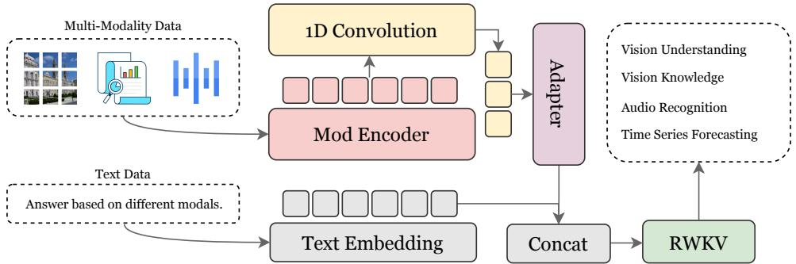
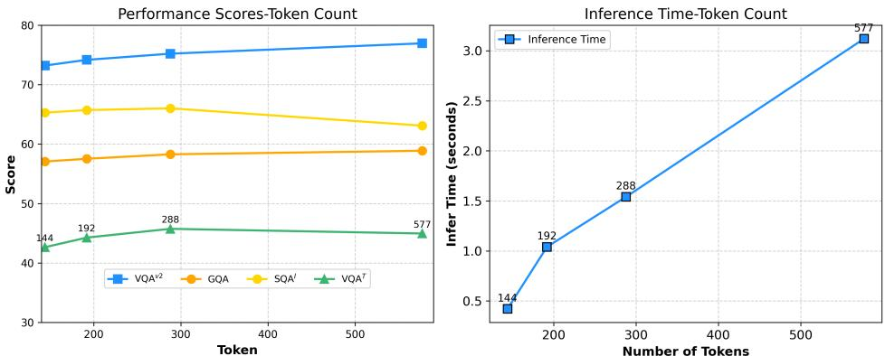

# ModRWKV：线性时间内的Transformer多模态

康佳乐\(^ {1 *}\)，岳子寅\(^ {1 *}\)，尹清宇\(^ {2 *}\)，姜锐\(^ {1,3}\)，李维乐\(^ {1}\)，芦泽宁\(^ {1}\)，纪周然\(^ {1}\) 1RWKvOS，2浙江大学，3香港科技大学 邮箱：jiale@rwkvos.com

# 摘要

目前，大多数多模态研究均基于具有二次复杂度的 Transformer 结构的大型语言模型（LLMs）。尽管诸如循环神经网络（RNN）等线性模型具有较低的推理开销，但其应用主要限于纯文本模态。本文探讨了现代 RNN 架构在多模态背景下的能力。我们提出了 ModRWKV——一套基于 RWKV7 架构作为语言模型主干的解耦多模态框架，借助动态可适配的异构模态编码器实现多源信息融合。ModRWKV 中的多模态模块设计极其轻量化，经过大量实验，我们确定了一种在性能与计算效率之间达到最佳平衡的配置。ModRWKV 利用 RWKV7 预训练权重进行初始化，显著加快多模态训练过程。不同预训练检查点的比较实验进一步证明，该初始化在提升模型多模态信号理解能力方面发挥了关键作用。基于丰富的实验结果，我们得出结论：现代 RNN 架构在多模态大型语言模型（MLLMs）领域中是 Transformer 的有效替代方案。此外，我们通过系统性探索确定了 ModRWKV 架构的最优配置。https://github.com/JL-er/ModRWKV.git

# 1 引言

线性复杂度模型（Peng 等，2025；Gu 和 Dao，2024；Yang 等，2024a，2025，2024b）作为基于注意力机制的 Transformer 架构（Vaswani 等，2023；Yin 等，2024）在大语言模型（LLMs）（Touvron 等，2023；Achiam 等，2023）中的一种高效替代方案已经出现。在众多线性模型中，循环神经网络（RNN）（Peng 等，2025）已成为一种有竞争力的方法。RNN 以恒定的内存使用为特征，相较于 Transformer 中线性增长的键值缓存（KV 缓存），它可以以更低的成本执行推理。最新研究还实现了 RNN 的并行训练能力（Yang 等，2024a，2025），这得益于针对现代 GPU 架构优化的硬件感知设计（Dao 等，2022）。目前，大语言模型正经历从单模态处理向跨模态协同的范式转变（Liu 等，2023；Fang 等，2025；Chen 等，2022；Défossez 等，2024）。通过利用预训练 LLM 权重的迁移学习，这些模型在视觉问答和语音对话等任务中实现了跨模态语义对齐。然而，这一实践主要应用于传统的 Transformer 架构。在线性模型领域，鲜有工作将其理解扩展至自然语言之外的模态。此差异凸显了当前线性模型领域的一个关键空白。本文中，我们介绍了 MoDRWKV。这是首个基于 RNN 的线性模型，其能力扩展至跨模态领域。MoDRWKV 基于 RWKV7 结构，这是一种基于推广的增量规则（generalized delta rule）、带有向量值门控、上下文内学习率以及松弛值替换规则（relaxed value replacement rule）的 RNN 架构。我们假设 RNN 天生的顺序处理能力，结合精心设计的共享参数基础，可以有效捕捉多样数据类型中的模态内和模态间依赖关系。我们利用 RWKV7 架构，提出了一种创新的统一多模态融合训练范式。MoDRWKV 采用轻量级共享参数基础与模态专用编码器框架，通过简单切换前端编码器，实现多模态任务之间的无缝迁移。该方法系统性地探索了 RNN 架构在跨模态语义空间中的表示能力，旨在打破以 Transformer 为主导的研究范式，为基于大型 RNN 模型在多模态领域的部署带来新的理论和实践见解。我们的贡献主要包括三方面：1. 提出了 MoDRWKV 框架，开创了基于 RNN 架构的统一多模态训练范式。通过采用即插即用的模态编码器设计，显著提升了跨模态的扩展性与集成效率。2. 对 MoDRWKV 的全模态理解能力进行了全面系统的评估，建立了评测基于 RNN 架构的跨模态性能的基准范式。3. 通过大量消融实验验证了实现性能与计算效率良好平衡的最佳多模态处理设计。

# 2 背景

RWKV7：现代循环神经网络架构 简单的线性循环神经网络（Qiao 等，2024；Gu 和 Dao，2024）可以表示为以下递归形式：

$$
h _ { t } = W h _ { t - 1 } + U x _ { t } ,
$$

这使得训练可以并行化，但缺乏强大的语言表现力和长期依赖保持能力。RWKV 结合了线性循环神经网络的高效性（推理时的内存和时间复杂度恒定）与其时间混合模块所带来的强大建模能力。它利用从 $\mathbf{\Delta} \mathbf{x}_t$ 线性投影得到的键 $k_t$ 和值 $v_t$，并通过输入依赖的衰减权重 ${\pmb w}_t$ 和接纳度 $\mathbf{\nabla} r_t$ 来更新状态 $\scriptstyle{s_t}$：

$$
\begin{array} { r } { s _ { t } = e ^ { - w _ { t } } \cdot s _ { t - 1 } + k _ { t } v _ { t } ^ { T } , } \end{array}
$$

在 RWKV7 中，状态更新以以下形式加强，以提升表达能力：

$$
\begin{array} { r } { s _ { t } = G _ { t } s _ { t - 1 } + { a } _ { t } k _ { t } v _ { t } ^ { T } , } \end{array}
$$

采用了一种广义的增量规则，并进行了两项改进：（1）上下文相关的学习率。向量值学习率项 $\mathbf{\delta} \mathbf{a}_t$ 被表示为 $a_t = W_a x_t$，控制新信息 $k_t v_t^T$ 对状态的影响。（2）向量值门控。动态转移矩阵 $G_t = (I - a_t k_t k_t^T) \mathrm{diag}(e^{-e^{w_t}})$ 融入了来自 $\mathbf{\Psi} \mathbf{w}_t = W_w \mathbf{x}_t$ 的向量值门控参数 ${\pmb w}_t$，实现了通道特定的衰减率。该输入依赖的设计使得 $\mathbf{\delta}_{s_t}$ 对上下文具有高度适应性。 多模态大型语言模型（MLLM）传统上在自然语言数据上进行训练，主要设计用于理解和生成文本。这些模型在基于文本的任务中表现优异，但固有地局限于人类语言领域。近年来，许多研究开始探索大型语言模型在语言之外的潜力，推动其能力扩展到其他模态。从模态角度看，MLLMs 现在处理的多种数据类型超越了文本，包括图像（Liu 等，2024a）、音频（Défossez 等，2024）以及视频。在结构上，这些模型通过引入特定模态的编码器进行适应，比如用于图像的视觉Transformer或用于声音的音频Transformer。输入整合方式则包括统一词元化——将所有模态转换为单一的词元序列，以及跨模态注意力机制，即模型关注跨模态的特征。

# 3 方法论

MoDRWKV 是首个基于循环神经网络（RNN）的多模态架构，融合了大规模多模态语言模型（MLLM）的训练范式与线性模型，实现了卓越的硬件效率。在第3.1节中，我们介绍了 MoDRWKV 的编码器选择设计。第3.2节详细阐述了 MoDRWKV 的适配器设计。第3.3节则描述了用于高效处理多样化多模态数据的序列压缩方法。

# 3.1 多模态编码器

视觉编码器。我们评估了 CLIP（Radford 等，2021）和 SigLIP2（Tschannen 等，2025）作为 MoDRWKV 的替代视觉编码器，并对每个模型独立应用相同的适配框架。每个视觉语言编码器处理原始图像以生成序列化特征嵌入，随后与...

  
FigureModRWKVnetworkarchitecture Multimodality data stresundergoinitl processin v a encode, a Convolutional layer, and an adapte. The 1 Convolutional layers employed to compress the sequencenth ouloaputs whiiantu uaiaveeurraigCnet ex data is transformed through a Text Embedding module. The outputs from the adapter and Text Embedding layers are subsequently concatenated.

通过轻量级适配器层实现RWKV大语言模型。我们的实验验证了MoDRWKV在视觉信息处理方面的强大内在能力，该框架即使在不对基础语言模型架构进行修改的情况下，也展示了出色的跨模态适应性。 音频编码器。在本研究中，我们采用WavLM（Chen等，2022）和Whisper（Radford等，2022）作为MoDRWKV的音频编码器。我们选择参数规模约为1亿到4亿的编码器模型，具体评估了WavLM base+、WavLM large、Whisper small和Whisper medium。这些编码器处理采样率为16,000 Hz的音频，并以50 Hz的频率生成特征向量。对于Whisper编码器，每个音频片段被填充至30秒的时长。 时间序列编码器。我们采用WaveNet（Van Den Oord等，2016）和Timer（Liu等，2024b）作为MoDRWKV的替代时序编码器。Timer采用预训练权重初始化，且训练时权重保持冻结状态；WaveNet则从零开始训练，不使用预训练权重。然而，在推理阶段，两者均冻结权重以实现零样本评估。每个编码器将原始时间序列数据转换为高级特征嵌入，随后通过轻量级适配器与RWKV模块进行对齐。

# 3.2 适配器设计

我们引入了一个单层多层感知机（MLP）适配器（Liu 等，2023）用于模态间的维度对齐，从而减少适配器的参数量。这使得 RWKV7 主干网络必须承担大部分跨模态推理任务，严格考验了基于循环神经网络（RNN）架构在多模态环境下的表现：

$$
\begin{array} { r } { \pmb { h } = \mathrm { L i n e a r } _ { 2 } ( \mathrm { R e L U } ( \mathrm { L i n e a r } _ { 1 } ( \pmb { x } ) ) ) . } \end{array}
$$

Table 1: Multimodal Benchmark Evaluation   

<table><tr><td>Benchmark</td><td>Description</td></tr><tr><td>VQA-v2 (Goyal et al., 2017) TextVQA (Singh et al., 2019) GQA (Hudson and Manning, 2019)</td><td>Image Understanding Text-Image Integration Reasoning</td></tr><tr><td>ScienceQA (Lu et al., 2022) POPE (Li et al., 2023)</td><td>Scientific Reasoning Hallucination</td></tr><tr><td></td><td></td></tr><tr><td>MMMU (Yue et al., 2024)</td><td>Reasoning</td></tr><tr><td>MMBench (Liu et al., 2024c)</td><td>Assessment</td></tr><tr><td>LibriSpeech (Panayotov et al., 2015) Speech Recognition</td><td></td></tr><tr><td>Aishell-1 (Bu et al., 2017)</td><td></td></tr><tr><td></td><td>Speech Recognition</td></tr><tr><td>GIFT-Eval (Aksu et al., 2024)</td><td>Time Series</td></tr><tr><td>UTSD (Liu et al., 2024b)</td><td>Time Series</td></tr></table>

# 3.3 序列压缩

为了解决大语言模型中长序列的计算难题，我们采用一维卷积对多模态序列（例如图像块、音频谱图）进行有效压缩。这种方法在显著降低计算开销的同时，保持了模型性能。对于输入 $\pmb{x} \in \mathbb{R}^{C_{\mathrm{in}} \times L}$，卷积核 ${\boldsymbol{W}} \in \mathbb{R}^{C_{\mathrm{out}} \times C_{\mathrm{in}} \times k}$，步幅 $s \geq 1$，填充 $p$，第 $c$ 个输出通道 $\boldsymbol{Y} \in \mathbb{R}^{C_{\mathrm{out}} \times L'}$ 的计算方式为：

$$
\pmb { y } _ { c } = \underbrace { \sum _ { i = 1 } ^ { C _ { \mathrm { i n } } } \left( \sum _ { j = 0 } ^ { k - 1 } \pmb { W } _ { c , i , j } \cdot \pmb { x } _ { i , s \cdot t + j } \right) } _ { \mathrm { C o n v 1 D } } + b _ { c } ,
$$

其中 $t = 0, \ldots, L^{\prime} - 1$，且 $L^{\prime}$ 的计算公式为 $\begin{array}{r} L^{\prime} = \left\lfloor \frac{L + 2p - k}{s} \right\rfloor + 1 \end{array}$。

Table 2: Comparison with SoTA methods on 7 benchmarks. Benchmark names are abbreviated due to space limits. VQA-v2; GQA; SQAI: ScienceQA-IMG; VQAT: TextVQA; POPE; MMB: MMBench; MMMU. PT and IT indicate the number of samples in the pretraining and instruction tuning stages, respectively.   

<table><tr><td>Method</td><td>LLM</td><td>PT</td><td>IT</td><td>VQAV2</td><td>GQA</td><td>SQAI</td><td>VQAT</td><td>POPE</td><td>MMB</td><td>MMMU</td></tr><tr><td>LLaVA-1.5</td><td>Vicuna-7B</td><td>558K</td><td>665K</td><td>78.5</td><td>62.0</td><td>66.8</td><td>58.2</td><td>86.5</td><td>64.3</td><td>-</td></tr><tr><td>LLaVA-1.5</td><td>Vicuna-13B</td><td>558K</td><td>665K</td><td>80.0</td><td>63.3</td><td>71.6</td><td>61.3</td><td>86.2</td><td>67.7</td><td>-</td></tr><tr><td>LLaVA-1.6</td><td>Vicuna-7B</td><td>558K</td><td>665K</td><td>81.8</td><td>64.2</td><td>72.8</td><td>65.7</td><td>86.7</td><td>67.7</td><td>35.8</td></tr><tr><td>LLaVA-Phi</td><td>Phi-2-2.7B</td><td>558K</td><td>665K</td><td>71.4</td><td>-</td><td>68.4</td><td>48.6</td><td>85.0</td><td>59.8</td><td>-</td></tr><tr><td>MobileVLM-3B</td><td>MobileLLaMA-2.7B</td><td>558K</td><td>665K</td><td>-</td><td>59.0</td><td>61.2</td><td>47.5</td><td>84.9</td><td>59.6</td><td>-</td></tr><tr><td>VL-Mamba</td><td>Mamba LLM-2.8B</td><td>558K</td><td>665K</td><td>76.6</td><td>56.2</td><td>65.4</td><td>48.9</td><td>84.4</td><td>57.0</td><td></td></tr><tr><td>MoDRWKV</td><td>RWKV7 LLM-3B</td><td>558K</td><td>665K</td><td>78.3</td><td>60.8</td><td>70.9</td><td>51.1</td><td>87.1</td><td>66.6</td><td>38.7</td></tr></table>

Table 3: Model's $\mathrm { W E R } ( \% )$ on Librispeech dataset and $\mathrm { C E R } ( \% )$ on Aishell-1 dataset.   

<table><tr><td>Dataset</td><td>Data (h)</td><td>Encoder</td><td>Clean WER(%)</td><td>Other WER(%)</td><td>Dev CER(%)</td><td>Test CER(%)</td></tr><tr><td rowspan="4">Librispeech</td><td rowspan="4">960</td><td>wavlm large</td><td>2.43</td><td>6.51</td><td>-</td><td>-</td></tr><tr><td>wavlm base+</td><td>3.08</td><td>10.38</td><td></td><td></td></tr><tr><td>whisper medium</td><td>5.33</td><td>12.28</td><td></td><td></td></tr><tr><td>whisper small</td><td>6.24</td><td>16.92</td><td></td><td>-</td></tr><tr><td rowspan="4">Aishell-1</td><td rowspan="4">178</td><td>wavlm large</td><td>-</td><td></td><td>9.68</td><td>10.33</td></tr><tr><td>wavlm base+</td><td></td><td></td><td>12.40</td><td>13.46</td></tr><tr><td>whisper medium</td><td></td><td></td><td>5.08</td><td>5.83</td></tr><tr><td>whisper small</td><td></td><td></td><td>6.29</td><td>6.95</td></tr></table>

# 4 实验

# 4.1 实验细节

训练设置 (1) 视觉。我们的实现遵循 LLaVA（Liu 等，2023）在视觉和音频理解中的分阶段训练范式。在第一阶段，我们首先冻结编码器和 RWKV 模型，仅训练一个包含单层多层感知机和层归一化的线性适配器，将多模态特征投射到语言模型的嵌入空间中。第二阶段则解冻适配器和 RWKV 参数，编码器保持冻结以保留预训练表征。为全面评估编码器选择和模型规模对 RWKV7 性能的影响，我们针对四个视觉语言标注数据，使用三种模型规模（0.4B、1.5B 和 3B）分别进行实验。模型在 8 块 NVIDIA A800 GPU 上训练。训练设置详情见附录 9。 (2) 音频。训练分为两个阶段：第一阶段仅训练音频适配器（学习率为 1e-4），第二阶段联合训练适配器和 RWKV（学习率从 1e-4 逐渐衰减至 5e-5）。LibriSpeech 数据集每个阶段运行 1 个 epoch；Aishell1 数据集第一阶段运行 2 个 epoch，第二阶段运行 4 个 epoch。默认批量大小为 32，Whisper 编码器因显存限制减至 16，epoch 数相应减半以保持训练步数一致。所有实验均使用 4 块 4 × 090 GPU。 (3) 时间序列。在时间序列任务中，我们使用双 NVIDIA RTX 4090（24GB）GPU 进行实验，训练了一个包含 441,725 个样本的短时单变量数据集。

数据集 我们考虑了视觉、音频和时间序列领域的多样化数据集（见表1）。针对视觉理解能力，第一阶段使用 LLaVA-595K 作为训练数据集，第二阶段使用 LLaVA-665K。音频方面，我们使用两个开源数据集训练 MoDRWKV 模型：（1）LibriSpeech（Panayotov 等，2015），包含960小时的英语朗读音频数据；（2）Aishell-1（Bu 等，2017），包含170小时的中文音频数据。对于每个数据集，我们分别仅在各自的训练集上训练模型。时间序列任务中，我们使用了 GIFT-Eval（Aksu 等，2024）公开数据集。经过细致整理和清洗后，获得了少量单变量数据集。此外，我们后续还整合了 UTSD（Liu 等，2024b）公开数据集。

基准测试 为了严格评估我们模型在多样推理场景下的能力，我们采用了涵盖基础视觉识别到高级知识密集任务的综合评估框架。该框架通过在七个多模态基准上进行测试，系统地验证模型在不同认知层面的跨模态能力： - VQA-v2（Goyal 等，2017）用于基础图像理解和问答； - TextVQA（Singh 等，2019）用于评估光学字符识别（OCR）与文本-图像融合能力； - GQA（Hudson 和 Manning，2019）用于组合推理与现实场景视觉理解； - ScienceQA（Lu 等，2022）通过多项选择题考察科学多模态推理； - POPE（Li 等，2023）通过二分类任务量化物体幻觉问题； - MMMU（Yue 等，2024）针对大学水平的跨学科问题进行挑战； - MMBench（Liu 等，2024c）作为系统设计、客观评估的综合评估框架，采用circularEval策略确保评估稳定性； - ETT（Qiu 等，2024）聚焦使用电力变压器温度数据进行长时间多变量时间序列预测，作为评估不同序列长度和预报时长下时序建模能力的标准基准； - WeatherBench（Rasp 等，2020）利用全球大气数据评估时空预测，作为数据驱动天气预报的标准基准等。 此外，我们还使用对应的开源数据集对MoDRWKV模型进行了评估：包括LibriSpeech（Panayotov 等，2015），涵盖960小时英语朗读音频数据，以及Aishell-1（Bu 等，2017），包含170小时中文语音数据。

Table 4: Zero-shot MSE with Adapter Scaling $4 \times$ use gift-eval datasets (WaveNet Encoder) (Qiu et al., 2024)   

<table><tr><td>Model</td><td>LB-FL</td><td>ECL</td><td>ETTh1</td><td>ETTh2</td><td>ETTm1</td><td>ETTm2</td><td>WTH</td><td>Traffic</td></tr><tr><td>TimeFM</td><td>720-96</td><td>0.119</td><td>0.421</td><td>0.326</td><td>0.363</td><td>0.206</td><td>0.123</td><td>0.327</td></tr><tr><td>Timer</td><td>720-96</td><td>0.221</td><td>0.414</td><td>0.305</td><td>0.440</td><td>0.203</td><td>0.178</td><td>0.526</td></tr><tr><td>UniTS</td><td>720-96</td><td>0.175</td><td>0.377</td><td>0.323</td><td>0.761</td><td>0.249</td><td>0.194</td><td>0.481</td></tr><tr><td>TTM</td><td>720-96</td><td>0.170</td><td>0.368</td><td>0.286</td><td>0.415</td><td>0.186</td><td>0.152</td><td>0.509</td></tr><tr><td>MOIRAI</td><td>720-96</td><td>0.212</td><td>0.394</td><td>0.285</td><td>0.516</td><td>0.222</td><td>0.208</td><td>1.359</td></tr><tr><td>ROSE</td><td>720-96</td><td>0.209</td><td>0.382</td><td>0.298</td><td>0.512</td><td>0.224</td><td>0.200</td><td>0.572</td></tr><tr><td>MoDRWKV(25% gift-eval)</td><td>720-96</td><td>0.342</td><td>0.746</td><td>0.633</td><td>0.754</td><td>0.559</td><td>0.797</td><td>0.512</td></tr><tr><td>MoDRWKV(100% gift-eval)</td><td>720-96</td><td>0.342</td><td>0.648</td><td>0.453</td><td>0.227</td><td>0.426</td><td>0.203</td><td>0.342</td></tr></table>

# 4.2 定性评估

视觉理解 如表2所示，MoDRWKV在八个广泛使用的多模态基准测试中表现出强大的整体性能，在其参数范围内优于现有的最先进方法。与VL-Mamba-2.8B相比，MoDRWKV-3B在所有评测任务上均取得更高分数，体现了其在视觉问答、组合推理和图像条件指令跟随方面的卓越能力。值得注意的是，尽管其语言主干网络远小于LLaVA-1.5-7B，MoDRWKV仍在多个基准上取得了具有竞争力甚至优越的结果。在ScienceQA-IMG、POPE及MMBench上超越了LLaVA-1.5-7B，同时在VQAv2上保持了可比性能。此外，MoDRWKV在MMMU基准上获得了同行中最高的报告分数，凸显了其在复杂多模态理解场景中的泛化能力。整体来看，这些结果表明MoDRWKV在性能和模型规模之间实现了良好权衡。其有效性不仅源于模型规模，更得益于架构效率和精心设计的多模态融合策略，使其成为较大型视觉语言模型的有力竞争替代方案。 视觉知识 表10中的以下示例展示了MoDRWKV问答聊天机器人的能力。这些例子说明了MoDRWKV如何有效地整合视觉信息和通用知识，同时进行基础逻辑推理，以应对常见用户查询。 语音识别 表3展示了LibriSpeech测试集test_clean和test_other的词错误率（WER），以及Aishell-1开发集和测试集的字符错误率（CER）。在LibriSpeech数据集中，模型在test_clean子集上实现了2.43%的WER，表明对清晰语音的识别精度较高。test_other子集上取得了6.51%的WER，表明模型在未进行数据增强的情况下能够合理应对更具挑战性的噪声语音样本。在Aishell-1数据集上，模型使用Whisper中等编码器，在开发集和测试集分别实现了5.08%和5.83%的CER，体现了其在训练数据有限的非英语语音识别任务中的有效性。

<table><tr><td>Dataset Size</td><td>Adapter Scaling</td><td>ECL</td><td>ETTh1</td><td>ETTh2</td><td>ETTm1</td><td>ETTm2</td><td>WTH</td><td>Traffic</td></tr><tr><td>Gift-Evel</td><td>2×</td><td>0.641</td><td>0.785</td><td>0.882</td><td>0.949</td><td>0.719</td><td>0.633</td><td>0.988</td></tr><tr><td>Gift-Evel + UTSD</td><td>2×</td><td>0.516</td><td>0.637</td><td>0.848</td><td>0.891</td><td>0.672</td><td>0.512</td><td>0.683</td></tr><tr><td>Gift-Evel + UTSD</td><td>4×</td><td>0.453</td><td>0.629</td><td>0.547</td><td>0.843</td><td>0.648</td><td>0.461</td><td>0.641</td></tr><tr><td>Gift-Evel + UTSD</td><td>8×</td><td>0.535</td><td>0.629</td><td>0.652</td><td>0.828</td><td>0.762</td><td>0.566</td><td>0.617</td></tr></table>

Table 6: MoDRWKV Visual Models with different Encoders and parameters tested on benchmarks.   

<table><tr><td>Vision</td><td>Size</td><td>VQAV2</td><td>VQAT</td><td>GQA</td><td>SQAI</td></tr><tr><td rowspan="3">CLIP</td><td>0.4B</td><td>62.04</td><td>31.72</td><td>49.32</td><td>51.10</td></tr><tr><td>1.5B</td><td>72.31</td><td>40.27</td><td>54.56</td><td>62.77</td></tr><tr><td>3B</td><td>73.13</td><td>45.56</td><td>57.00</td><td>70.66</td></tr><tr><td rowspan="3">SigLIP2</td><td>0.4B</td><td>72.04</td><td>38.75</td><td>55.52</td><td>43.32</td></tr><tr><td>1.5B</td><td>76.95</td><td>44.96</td><td>58.88</td><td>63.10</td></tr><tr><td>3B</td><td>78.30</td><td>51.09</td><td>60.75</td><td>70.93</td></tr></table>

在适配器训练过程中，我们观察到了一种类似于（Ma et al., 2024）所描述的能力涌现现象。然而，这种涌现的时机并不一致，且受适配器权重初始化的影响较大。在某些情况下，适配器在第一阶段未能收敛。

时间序列预测 我们对两种时序编码器架构进行了对比实验：Timer 和 WaveNet。结果（见表4）显示，尽管 Timer 基于预训练权重的参数量更大，但在下游时间序列预测任务中始终不及 WaveNet。我们推测，这一性能差距源于 WaveNet 采用了因果膨胀卷积，通过分层扩展的感受野有效捕捉长距离时间依赖。此外，不同于 Timer 的分块嵌入，WaveNet 采用点式嵌入策略，使其能够提取更细粒度的时序特征。在训练数据准备方面，我们构建了两个微调数据集：基线数据集（GIFTEval）（Aksu 等，2024）和由 GIFT-Eval 及部分处理过的 UTSD 子集（Liu 等，2024b）组成的增强数据集。实验表明，在包含异常样本的增强数据集上训练的模型在包括 ECL、ETT、WTH 和 Traffic 等公共基准的零样本评估中实现了更优的泛化性能。值得注意的是，该训练策略使模型在分布漂移情形下仍能保持稳定预测，展现出较强的鲁棒性和泛化能力。架构消融研究进一步揭示，适配器模块的缩放因子对性能起重要作用。缩放因子为 $4 \times$ 在验证集上取得了最佳总体效果（见表5），相比 $8 \times$ 和 $2 \times$ 分别提升约 $10.0\%$ 和 $13.5\%$。总体来看，即使在无数据增强、训练数据有限且训练步骤较少的受限条件下，MoDRWKV 模型仍在时间序列预测任务中取得了具有竞争力的准确率，为其在复杂现实场景中的适用性提供了实证依据。

不同视觉编码器的影响 为了评估不同视觉编码器对多模态模型性能的影响，本研究设计了严格的对比实验。我们选择了两个具有代表性的视觉编码器架构进行比较：基于对比学习的CLIP和最近提出的SigLIP2。在实验设计中，我们特别控制了以下变量：两个编码器（google/siglip2-base-patch16-384和openai/clipvit-large-patch14-336）编码的视觉特征序列长度均设置为577，以消除序列长度差异可能带来的混淆，防止影响大语言模型的理解能力；并对不同规模（参数量从0.4亿到3亿不等）的大语言模型进行了交叉验证，以确保实验结论的普适性。

Table 7: By controlling the kernel and stride of conv1d, control the sequence length of multimodal signals to compare performance differences.   

<table><tr><td>Size</td><td>(k,s)</td><td>Token</td><td>VQAV2</td><td>VQAT</td><td>GQA</td><td>SQA1</td></tr><tr><td rowspan="4">1.5B</td><td>(0,0)</td><td>577</td><td>76.95</td><td>44.96</td><td>58.88</td><td>63.10</td></tr><tr><td>(3,2)</td><td>288</td><td>75.21</td><td>45.75</td><td>58.28</td><td>66.02</td></tr><tr><td>(4,3)</td><td>192</td><td>74.17</td><td>44.27</td><td>57.53</td><td>65.72</td></tr><tr><td>(5,4)</td><td>144</td><td>73.21</td><td>42.65</td><td>57.07</td><td>65.29</td></tr></table>

如表6所示，SigLIP2编码器在所有评测基准上均优于CLIP编码器，包括VQAv2、TextVQA、GQA和ScienceQA。值得注意的是，基于SigLIP2的模型在通用视觉问答、基于文本的视觉问答任务以及组合推理任务中均取得显著提升。尽管其编码器参数仅为9千万，约为CLIP编码器规模的30%，SigLIP2在细粒度视觉-文本对齐和语义理解等任务上表现尤为优越。这些结果强调了多模态理解中模型效果更多依赖于编码器设计和预训练方法，而非单纯参数规模。 一维卷积序列压缩的效率 长序列处理的效率问题长期以来一直是限制大型语言模型性能的主要瓶颈之一。在多模态任务中，这一挑战尤为突出，因为来自不同模态的信号编码后通常生成大量词元。例如，在MoDRWKV模型中，通过SigLIP2编码器编码的单张图像生成了577个词元，扩展到视频序列时，序列长度会增加一个数量级。为了解决这一问题，本节系统地探讨了一维卷积降维（Conv1D）的优化效果，旨在为序列压缩研究提供新的技术见解。

Table 8: Performance differences under different pretraining weights   

<table><tr><td>Size</td><td>Model</td><td>VQAV2</td><td>VQAT</td><td>GQA</td><td>SQA1</td></tr><tr><td rowspan="2">0.4B</td><td>base</td><td>72.04</td><td>38.75</td><td>55.52</td><td>43.32</td></tr><tr><td>g1</td><td>73.21</td><td>41.13</td><td>57.34</td><td>55.58</td></tr><tr><td rowspan="2">1.5B</td><td>base</td><td>76.95</td><td>44.96</td><td>58.88</td><td>63.10</td></tr><tr><td>g1</td><td>77.87</td><td>50.91</td><td>60.18</td><td>64.63</td></tr></table>

关于ScienceQA任务的研究进一步表明，随着卷积核大小和步幅的增大，虽然模型性能逐渐下降，但计算效率显著提升。我们在单张4090 GPU上未采用任何加速措施测试了MoDRWKV-1.5B；结果表明，增加词元序列的压缩比能够显著加快推理速度，展现出明显的效率提升。这强调了一种在计算效率与模型性能之间实现平衡的有效策略，为实际部署提供了宝贵的参考。 G1推理模型方面，我们通过比较RWKV7-0.4B模型的两组预训练权重（base和g1）实验验证了文本预训练权重对大语言模型多模态理解能力的影响。需要指出的是，g1模型是在base模型基础上，通过引入大量“思考”（think）类型数据进行后续训练得到的改进版本。尽管两者在纯文本NLP基准测试中表现相近（如表8所示），采用g1预训练权重进行微调后，在所有指标上的表现均显著优于base模型，尤其在SQA指标上提升尤为显著（具体提升幅度为28%）。该实证结果有力证明了合理的文本预训练策略能够有效增强语言模型的多模态理解能力，从而提升其下游任务的整体表现。 我们针对ModRWKV1.5B模型架构，以LLaVA训练数据集为基础进行了实证研究（见表7及图2可视化），并在多个基准数据集（包括VQAv2、TextVQA、GQA和ScienceQA）上进行了全面评估。实验结果表明，在序列长度压缩50%时，模型整体性能仅略有下降（平均水平），但推理准确率提高了4.6%。 时序预测编码器方面，与Timer和WaveNet的对比中，在前馈神经网络（FFN）中，ReLU等激活函数通过将部分输出置零引入稀疏性，这会降低输出矩阵的秩，从而可能影响模型的表示能力。通过理论分析及基于表5数据的实证实验发现，当隐藏层维度设置为输入维度的2倍或8倍时，该机制的效果均不理想。

  

Figure 2: Performance and effciency of ModRWKV. Left. The scaling curve of tokens with the performance score. Right. The inference time of MoDRWKV with the number of tokens.

表5展示了不同适配器缩放配置在多个公共数据集（包括ECL、ETTh、ETTm、WTH和Traffic）上的零样本均方误差（MSE）表现。结果表明，将适配器缩放因子从2倍提升至4倍，在大多数数据集上均显著提升了性能，且4倍缩放时的MSE值最低。具体而言，使用4倍缩放的Gift-Evel^+ UTSD模型在ECL（0.453）、ETTh1（0.629）、ETTh2（0.547）、ETTm2（0.648）、WTH（0.461）和Traffic（0.641）上均取得了最佳结果，证明该配置有效增强了模型准确性。然而，进一步将缩放因子提升至8倍并未持续改善性能，部分数据集的误差反而有所增加，表明过大的隐藏层维度可能引入不稳定性或降低表征效率。基于此，我们建议将隐藏层维度设置为输入维度的至少4倍，以保持足够的秩，从而提升模型的表征能力和稳定性。

$$
p = 1 - \frac { \sum _ { i = m } ^ { n } \binom { n } { i } } { 2 ^ { n } }
$$

表4展示了在使用WaveNet编码器且适配器缩放比例为4×的情况下，各模型在公开数据集上的零-shot均方误差（MSE）结果，使用了gift-eval数据集。模型在多个时间序列预测基准测试集上进行评估，包括ECL、ETTh、ETTm、WTH和Traffic，回溯长度为720，预测长度为96。结果显示，TimeFM在ECL（0.119）、WTH（0.123）和Traffic（0.327）上表现最佳，展现了其在这些数据集上的强大预测能力。TTM在ETTh1（0.368）和ETTm2（0.186）上表现最优，而MOIRAI在ETTh2（0.285）上误差最低。我们提出的模型MoDRWKV（100% gift-eval）在ETTm1（0.227）上优于其他模型，显示了其在该数据集短期预测任务中的有效性。比较MoDRWKV（25% gift-eval）与MoDRWKV（100% gift-eval）时，我们观察到增加gift-eval数据比例显著提升了大多数数据集上的性能，尤其是在ETTh2（从0.633提升到0.453）和ETTm1（从0.754提升到0.227）上，表明利用更大比例的gift-eval数据有助于增强模型的泛化能力和稳定性。总体而言，结果突出了不同模型在各数据集上的不同优势，强调了数据集构成和模型架构在实现最佳预测性能中的重要性。

# 5 结论

本文提出了 MoDRWKV，一种通过可替换编码器实现模态切换的多模态理解框架。基于 RWKV7，MoDRWKV 对现代循环神经网络架构在多模态领域的能力进行了全面分析和评估。

# 6 限制因素

本文系统评估了所提出的MoDRWKV框架在包含不同模态的一系列基准任务上的表现，验证了将线性结构模型应用于多模态大语言模型（MLLM）的可行性。然而，本文尚未探索更复杂的多模态融合场景，例如涉及语音、视觉和语言的三模态任务。未来工作将致力于解决这些更丰富的多模态设置。

# References

Josh Achiam, Steven Adler, Sandhini Agarwal, Lama Ahmad, Ilge Akkaya, Florencia Leoni Aleman, Diogo Almeida, Janko Altenschmidt, Sam Altman, Shyamal Anadkat, et al. 2023. Gpt-4 technical report. arXiv preprint arXiv:2303.08774.

Taha Aksu, Gerald Woo, Juncheng Liu, Xu Liu, Chenghao Liu, Silvio Savarese, Caiming Xiong, and Doyen Sahoo. 2024. Gift-eval: A benchmark for general time series forecasting model evaluation. arxiv preprint arxiv:2410.10393.

Hui Bu, Jiayu Du, Xingyu Na, Bengu Wu, and Hao Zheng. 2017. Aishell-1: An open-source mandarin speech corpus and a speech recognition baseline.

Tri Dao, Daniel Y. Fu, Stefano Ermon, Atri Rudra, and Christopher Ré. 2022. Flashattention: Fast and memory-efficient exact attention with io-awareness.

Alexandre Défossez, Laurent Mazaré, Manu Orsini, Amélie Royer, Patrick Pérez, Hervé Jégou, Edouard Grave, and Neil Zeghidour. 2024. Moshi: a speechtext foundation model for real-time dialogue.

Qingkai Fang, Shoutao Guo, Yan Zhou, Zhengrui Ma, Shaolei Zhang, and Yang Feng. 2025. Llama-omni: Seamless speech interaction with large language models.

Yash Goyal, Tejas Khot, Douglas Summers-Stay, Dhruv Batra, and Devi Parikh. 2017. Making the V in VQA matter: Elevating the role of image understanding in Visual Question Answering.

Albert Gu and Tri Dao. 2024. Mamba: Linear-time sequence modeling with selective state spaces.

Drew A. Hudson and Christopher D. Manning. 2019. Gqa: A new dataset for real-world visual reasoning and compositional question answering. pages 6693 6702.

Yifan Li, Yifan Du, Kun Zhou, Jinpeng Wang, Wayne Xin Zhao, and Ji rong Wen. 2023. Evaluating object hallucination in large vision-language models.

Haotian Liu, Chunyuan Li, Yuheng Li, and Yong Jae Lee. 2024a. Improved baselines with visual instruction tuning.

Haotian Liu, Chunyuan Li, Qingyang Wu, and Yong Jae Lee. 2023. Visual instruction tuning.

Yong Liu, Haoran Zhang, Chenyu Li, Xiangdong Huang, Jianmin Wang, and Mingsheng Long. 2024b. Timer: Generative pre-trained transformers are large time series models. arXiv preprint arXiv:2402.02368.

Yuan Liu, Haodong Duan, Yuanhan Zhang, Bo Li, Songyang Zhang, Wangbo Zhao, Yike Yuan, Jiaqi Wang, Conghui He, Ziwei Liu, Kai Chen, and Dahua Lin. 2024c. Mmbench: Is your multi-modal model an all-around player?

Pan Lu, Swaroop Mishra, Tony Xia, Liang Qiu, Kai-Wei Chang, Song-Chun Zhu, Oyvind Tafjord, Peter Clark, and A. Kalyan. 2022. Learn to explain: Multimodal reasoning via thought chains for science question answering. ArXiv, abs/2209.09513.

Ziyang Ma, Guanrou Yang, Yifan Yang, Zhifu Gao, Jiaming Wang, Zhihao Du, Fan Yu, Qian Chen, Siqi Zheng, Shiliang Zhang, and Xie Chen. 2024. An embarrassingly simple approach for llm with strong asr capacity.

Vassil Panayotov, Guoguo Chen, Daniel Povey, and Sanjeev Khudanpur. 2015. Librispeech: An asr corpus based on public domain audio books. In 2015 IEEE International Conference on Acoustics, Speech and Signal Processing (ICASSP), pages 52065210.

Bo Peng, Ruichong Zhang, Daniel Goldstein, Eric Alcaide, Xingjian Du, Haowen Hou, Jiaju Lin, Jiaxing Liu, Janna Lu, William Merrill, Guangyu Song, Kaifeng Tan, Saiteja Utpala, Nathan Wilce, Johan S. Wind, Tianyi Wu, Daniel Wuttke, and Christian ZhouZheng. 2025. Rwkv-7 "goose" with expressive dynamic state evolution.

Yanyuan Qiao, Zheng Yu, Longteng Guo, Sihan Chen, Zijia Zhao, Mingzhen Sun, Qi Wu, and Jing Liu. 2024. Vl-mamba: Exploring state space models for multimodal learning.

Xiangfei Qiu, Jilin Hu, Lekui Zhou, Xingjian Wu, Junyang Du, Buang Zhang, Chenjuan Guo, Aoying Zhou, Christian S Jensen, Zhenli Sheng, et al. 2024. Tfb: Towards comprehensive and fair benchmarking of time series forecasting methods. arXiv preprint arXiv:2403.20150.

Alec Radford, Jong Wook Kim, Chris Hallacy, Aditya Ramesh, Gabriel Goh, Sandhini Agarwal, Girish Sastry, Amanda Askell, Pamela Mishkin, Jack Clark, Gretchen Krueger, and Ilya Sutskever. 2021. Learning transferable visual models from natural language supervision.

Alec Radford, Jong Wook Kim, Tao Xu, Greg Brockman, Christine McLeavey, and Ilya Sutskever. 2022. Robust speech recognition via large-scale weak supervision.

Zheng, Zhenzhu Yang, Yibo Liu, Wenhao Huang, Huan Sun, Yu Su, and Wenhu Chen. 2024. Mmmu: A massive multi-discipline multimodal understanding and reasoning benchmark for expert agi.

Stephan Rasp, Peter D Dueben, Sebastian Scher, Jonathan A Weyn, Soukayna Mouatadid, and Nils Thuerey. 2020. Weatherbench: a benchmark data set for data-driven weather forecasting. Journal of Advances in Modeling Earth Systems, 12(11):e2020MS002203.

Amanpreet Singh, Vivek Natarajan, Meet Shah, Yu Jiang, Xinlei Chen, Dhruv Batra, Devi Parikh, and Marcus Rohrbach. 2019. Towards vqa models that can read. pages 83098318.

Hugo Touvron, Thibaut Lavril, Gautier Izacard, Xavier Martinet, Marie-Anne Lachaux, Timothée Lacroix, Baptiste Rozière, Naman Goyal, Eric Hambro, Faisal Azhar, Aurelien Rodriguez, Armand Joulin, Edouard Grave, and Guillaume Lample. 2023. Llama: Open and efficient foundation language models.

Michael Tschannen, Alexey Gritsenko, Xiao Wang, Muhammad Ferjad Naeem, Ibrahim Alabdulmohsin, Nikhil Parthasarathy, Talfan Evans, Lucas Beyer, Ye Xia, Basil Mustafa, Olivier Hénaff, Jeremiah Harmsen, Andreas Steiner, and Xiaohua Zhai. 2025. Siglip 2: Multilingual vision-language encoders with improved semantic understanding, localization, and dense features.

Aaron Van Den Oord, Sander Dieleman, Heiga Zen, Karen Simonyan, Oriol Vinyals, Alex Graves, Nal Kalchbrenner, Andrew Senior, Koray Kavukcuoglu, et al. 2016. Wavenet: A generative model for raw audio. arXiv preprint arXiv:1609.03499, 12.

Ashish Vaswani, Noam Shazeer, Niki Parmar, Jakob Uszkoreit, Llion Jones, Aidan N. Gomez, Lukasz Kaiser, and Illia Polosukhin. 2023. Attention is all you need.

Songlin Yang, Bailin Wang, Yikang Shen, Rameswar Panda, and Yoon Kim. 2024a. Gated linear attention transformers with hardware-efficient training.

Songlin Yang, Bailin Wang, Yu Zhang, Yikang Shen, and Yoon Kim. 2024b. Parallelizing linear transformers with the delta rule over sequence length. arXiv preprint arXiv:2406.06484.

Songlin Yang, Bailin Wang, Yu Zhang, Yikang Shen, and Yoon Kim. 2025. Parallelizing linear transformers with the delta rule over sequence length.

Qingyu Yin, Xuzheng He, Xiang Zhuang, Yu Zhao, Jianhua Yao, Xiaoyu Shen, and Qiang Zhang. 2024. Stablemask: Refining causal masking in decoderonly transformer. arXiv preprint arXiv:2402.04779.

Xiang Yue, Yuansheng Ni, Kai Zhang, Tianyu Zheng, Ruoqi Liu, Ge Zhang, Samuel Stevens, Dongfu Jiang, Weiming Ren, Yuxuan Sun, Cong Wei, Botao Yu, Ruibin Yuan, Renliang Sun, Ming Yin, Boyuan

# A Example Appendix

Table 9: Hyperparameter Settings for Visual Instruction Tuning of MoDRWKV   

<table><tr><td>Hyperparameter</td><td>Step1</td><td>Step2</td></tr><tr><td>bsz</td><td>256</td><td>128</td></tr><tr><td>ctx_len</td><td></td><td>2048</td></tr><tr><td>br</td><td>1e-3</td><td>2e-5</td></tr><tr><td>warmup_steps</td><td></td><td>100</td></tr><tr><td>beta1</td><td></td><td>0.9</td></tr><tr><td>beta2</td><td></td><td>0.99</td></tr><tr><td>adam_eps</td><td></td><td>1e-8</td></tr><tr><td>precision</td><td></td><td>bf16</td></tr><tr><td>lr_schedule</td><td></td><td>wsd</td></tr></table>

# A.1 Examples

# Visual Examples

# User MODRWKV

How many Cars in this picture? There are two cars in the picture, with one being the taxi cab the man is standing on.

[Start a new conversation, and clear the history]

User   
MODRWKV User   
MODRWKV

What is the name of this picture? The name of this picture is "Starry Night " Who drew it? Vincent van Gogh drew this picture.

User Is this real in current life?   
MoDRWKV No, this is not a real animal. It is a computer-generated image (CGI) of a dinosaur, specifically a T-Rex, walking through a forest.   
User Depict the environment   
MODRWKV The environment in the image is a forest with trees, rocks, and a dirt path. The CGI dinosaur is walking through this natural setting.   
User Based on the facial expression, what is it's emotion?   
MODRWKV The dinosaur appears to be angry, as it is depicted with its mouth open and teeth showing.   
User Based on its emotion and the environment, what do you think this dinosaur is doing right now?   
MODRWKV Based on its angry expression and the forest setting, it is possible that the dinosaur is either searching for food, defending its territory, or reacting to a perceived threat. The fact that it is walking through the forest suggests that it might be exploring its habitat or looking for prey. However, without more context or information, it is difficult to determine the exact reason for its current behavior.

Table 11: Interactive Audio Examples Demonstrating Question-Answer Capabilities   

<table><tr><td colspan="2">Audio Examples</td></tr><tr><td>User MoDRWKV</td><td>What is your name? Hello! My name is RWKV, and I&#x27;m your friendly voice assistant here to help with any questions or tasks you have.</td></tr><tr><td>User MoDRWKV</td><td>4p Can I drink coffee before I go to bed? Yes, you can drink coffee before you go to bed, but it&#x27;s important to do so in moderation. Drinking coffee too close to bedtime can interfere with your sleep quality. Try to have your last cup of coffee at least 6 hours before bedtime. If you&#x27;re sensitive to caffeine, you might want to avoid it altogether. Also, consider other relaxing activities before bed to help you wind down</td></tr><tr><td>User MODRWKV</td><td>4p Tell me something about machine learning. Machine learning is a branch of artificial intelligence that focuses on creating systems that can learn from and make decisions based on data. It involves algorithms that enable computers to identify patterns and make predictions or decisions without being explicitly programmed for each task. This technology is widely used in various applications, such as recommendation systems, speech recognition, and autonomous vehicles. Machine learning models can improve over time as more data is processed, making them more accurate and efficient. It&#x27;s a powerful tool for automating tasks, enhancing user experiences, and driving innovation across many industries.</td></tr></table>